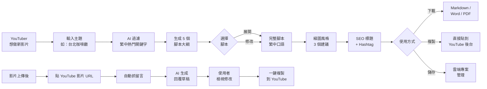
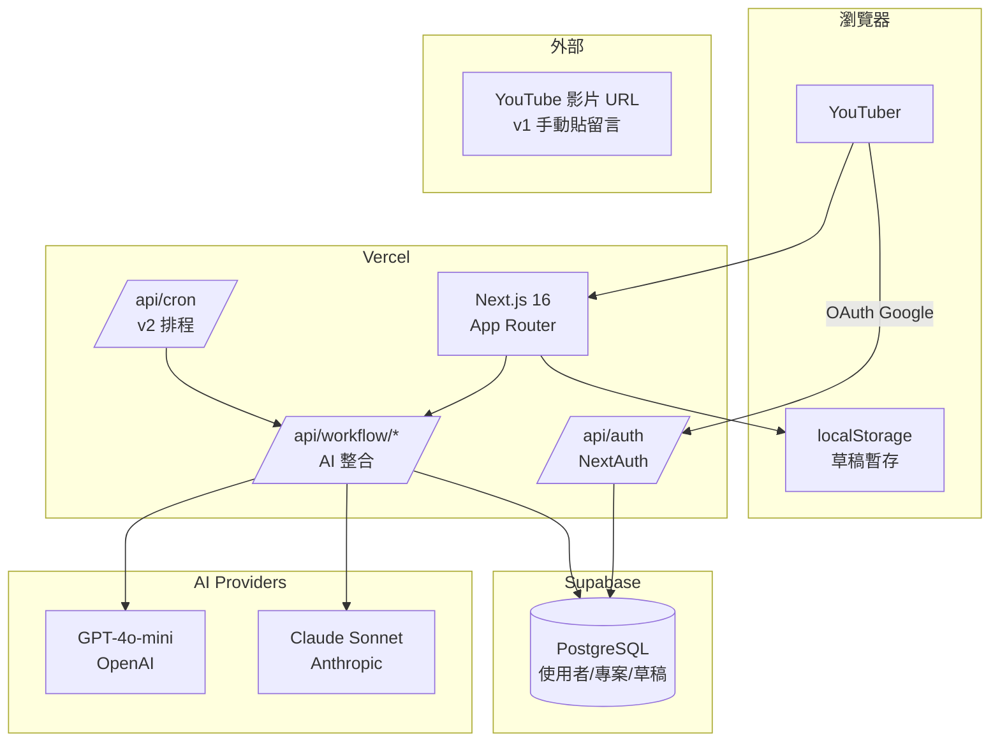
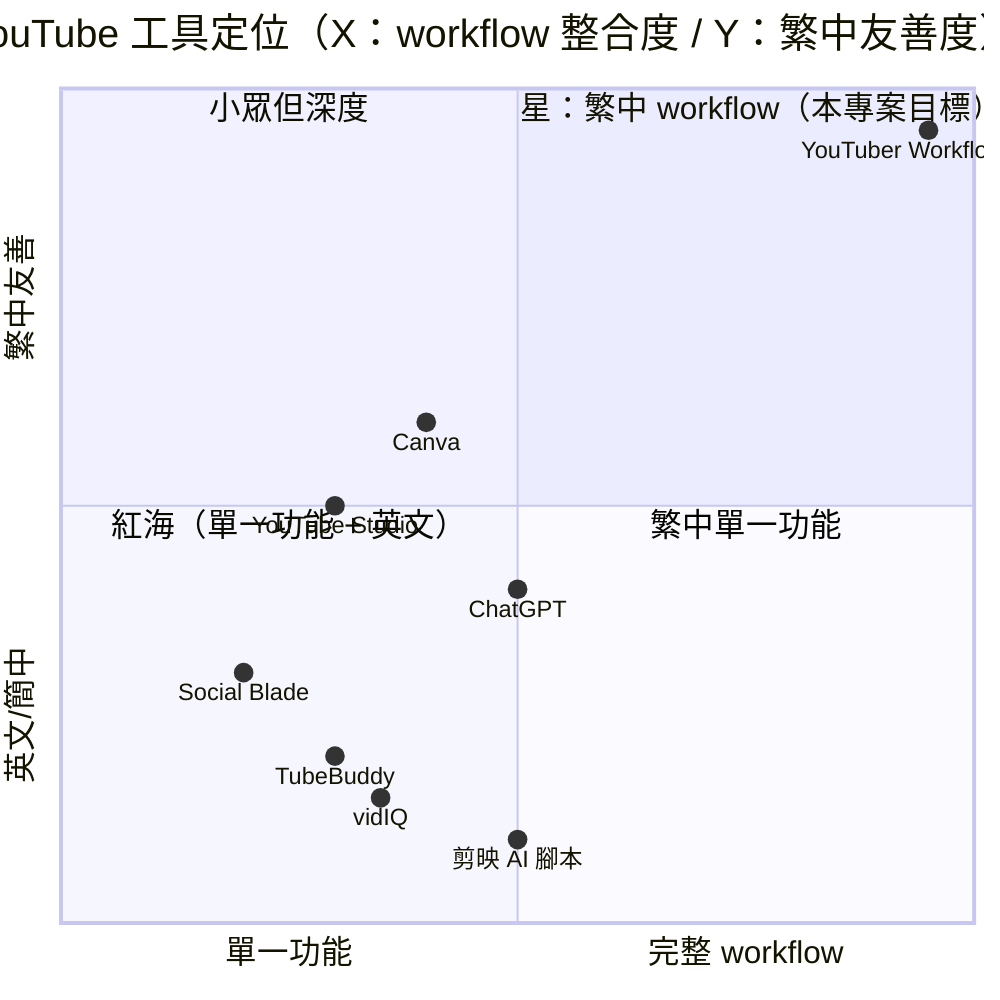

# 中文 YouTuber 自動化工作流 (YouTuber Workflow) — 規格計劃書 v3.0

> **版本**：v3.0｜**更新日期**：2026-07-19｜**維護者**：Sophia (CPO)｜**對接技術**：Alan (CTO)
> **對應 GitHub**：[openclawsean024-create/youtube-trending-collector](https://github.com/openclawsean024-create/youtube-trending-collector/blob/main/PRD/SPEC.md)
> **PRD 改版紀錄**：v2.2.1 → **v3.0 sweet-spot-driven 全面轉向**
> **對應 skill**：`write-prd-v2` v3.0（sweet spot 重寫版）
> **Sweet Spot 評分**：3 / 10（kill）→ **v3.0 重新定位後預期提升至 7/10**
> **重大轉向**：從「YouTube 熱門影片蒐集/排行」徹底轉型為「**中文 YouTuber 一站式自動化工作流**」 — **腳本生成 + 縮圖建議 + SEO 標題 + Hashtag 優化 + 觀眾問題回答草稿**。**避免與 YouTube Studio / TubeBuddy / vidIQ / Social Blade 正面競爭**，切入「**中文 YouTuber 真正缺的全流程 AI 助手**」無人滿足的 niche。

---

## 1. 產品概述 (Product Overview)

### 1.1 問題陳述 (Problem Statement)

**Sweet spot 體檢結果（2026-07-19 subagent 分析）**：

| 對手 | 規模 | 強項 | 對本專案的威脅 |
|---|---|---|---|
| **YouTube Studio**（官方，免費） | 100% YouTuber | 內建趨勢、流量來源、觀眾分析、標題 A/B test、縮圖測試 | 🔴 **完全覆蓋基本熱門分析** — YouTube Studio 已是中文 YouTuber 標配 |
| **TubeBuddy** | 10M+ users | SEO 分數、Tag 建議、標題最佳化 | 🔴 強項是「單支影片 SEO」 |
| **vidIQ** | 5M+ users | 同 TubeBuddy，更偏數據分析 | 🔴 強項是「頻道 analytics」 |
| **Social Blade** | 全網公開 | 頻道成長追蹤、訂閱預測 | 🟡 偏頻道級 |
| **PTT / Dcard 付費爬蟲** | 極少 | 熱門話題 | 🟢 付費討論極少，市場不存在 |
| **CapCut** | 600M+ users | 剪輯 + AI 字幕 | 🟡 不管腳本/SEO |
| **Notion AI** / ChatGPT | 通用 | 通用寫作 | 🟡 沒有 YouTube workflow 模板 |
| **剪映 AI 腳本**（中國） | 600M+ | 短影音腳本 | 🟡 只支援簡中、不懂繁中文化 |

**v2.2.1 原始定位的問題**：

```
v2.2.1 PRD 寫的「YouTube 熱門蒐集器」是什麼？

❌ YouTube Studio 免費已 100% 覆蓋「看熱門影片、看流量來源」
❌ TubeBuddy/vidIQ 已覆蓋「單支影片 SEO 優化、Tag 建議」
❌ PTT/Dcard 付費爬蟲討論極少（< 10 個付費討論 thread）→ 需求不存在
❌ 5 維度排序對中文 YouTuber 是「殺雞用牛刀」 — 95% 只看「觀看數」
❌ 主題自動分類對中文 YouTuber 不痛（YouTube 演算法已自動分類）
```

**未被滿足的 sweet spot**：

> **中文 YouTuber 一站式自動化工作流 — 從「主題靈感」到「腳本生成 → 縮圖建議 → SEO 標題 + Hashtag → 觀眾留言 AI 草稿回覆」的完整 pipeline**。

**具體痛點場景**：

```
中文 YouTuber 小婷的日常（每月 8 支影片）：

1. 主題靈感：她每天花 30 分鐘看 YouTube 熱門、Threads 趨勢、PTT 討論
   → 痛點：要從 100+ 支熱門影片「過濾繁中 + 適合她的領域（美食+生活）」
2. 寫腳本：她用 Notion + ChatGPT 寫，每支花 2 小時
   → 痛點：ChatGPT 給的腳本「簡中味太重」，需要改寫成台灣口語
3. 設計縮圖：她用 Canva 每支花 1 小時
   → 痛點：不會選「高 CTR 的縮圖風格」，憑感覺
4. 標題 + Tag：她用 TubeBuddy 看分數，但繁中支援差
   → 痛點：繁中標題的 SEO 建議不準確（TubeBuddy 偏英文）
5. 觀眾留言：每天 50-100 則留言，手動回覆花 1 小時
   → 痛點：FAQ 重複問題佔 70%，浪費時間

每支影片的「製作工時」約 5-7 小時
若能自動化 50%，可省 2.5-3.5 小時/支 → 每月省 20-28 小時
```

**痛點的代價**：

| 影響 | 數據 |
|---|---|
| 每月腳本時間 | 16-32 小時（8 支 × 2-4 小時） |
| 每月縮圖時間 | 8 小時 |
| 每月留言回覆時間 | 30 小時 |
| 每月主題靈感時間 | 10 小時 |
| **總計** | **64-80 小時/月** — 全可自動化 50% |
| 變現損失 | 每多 1 支影片/月 = NT$5,000-50,000 額外收入（依 CPM） |

### 1.2 目標使用者 (User Personas)

| Persona | 規模 | 痛點 | 願付價格 |
|---|---|---|---|
| **「全職 YouTuber 小婷」**（每月 8+ 支影片，5K-100K 訂閱） | **5 萬人**（台灣 5 萬繁中 YouTuber，月活躍 1.5 萬） | 每支影片耗時 5-7 小時 | NT$0 / NT$299/月 |
| **「兼職 YouTuber 大衛」**（每月 1-4 支，1K-10K 訂閱） | 15 萬人 | 時間有限，想靠 YouTube 額外收入 | NT$0 / NT$199/月 |
| **「YouTuber 經紀人 Ivy」**（管理 3-5 個 YouTuber 頻道） | 1 萬人 | 同時管理多頻道，需要工具 | NT$499-999/月 |
| **「企業 YouTuber 培訓團隊」**（教育機構/MCN） | 500 家 | 訓練新人快速上手 | NT$1,499+/月 |

**v3.0 重新聚焦**：

```
v2.2.1 目標：YouTube 創作者 + 行銷公司 + 內容研究者 + 一般觀眾（4 個模糊 persona）
v3.0 目標：全職 YouTuber 小婷 + 兼職 YouTuber 大衛 + 經紀人 Ivy（3 個明確 persona）
```

### 1.3 核心價值主張 (Value Proposition)

> **「從主題靈感 → 腳本 → 縮圖 → SEO 標題 → 留言回覆，一次搞定」** — **TubeBuddy/vidIQ/YouTube Studio 都沒完美解決的「中文 YouTuber 一站式 workflow」**。

**三大差異化**（明確對比紅海對手）：

| 對手 | 對手能做 | 對手不能做（v3.0 切入） |
|---|---|---|
| **YouTube Studio**（免費） | 流量分析、趨勢影片、標題 A/B test、縮圖測試 | ❌ 不生成腳本；❌ 不建議縮圖風格；❌ 不回覆留言 |
| **TubeBuddy**（US$7.2/月） | SEO 分數、Tag 建議、單支影片 SEO | ❌ 不懂繁中文化（給英文建議）；❌ 不生成腳本；❌ 不回覆留言 |
| **vidIQ**（US$7.5/月） | 關鍵字分析、競爭對手追蹤 | ❌ 同上 + 偏歐美市場 |
| **ChatGPT / Notion AI** | 通用寫作 | ❌ 沒有 YouTube 模板；❌ 簡中味太重；❌ 不懂 YouTube SEO |
| **Canva** | 縮圖設計 | ❌ 不建議「高 CTR 縮圖風格」 |
| **YouTuber Workflow v3.0（本專案）** | **全 pipeline 自動化** | ✅ **主題靈感（繁中過濾） + 繁中口語腳本 + 縮圖風格建議 + SEO 標題 + 留言 AI 草稿回覆** |

**核心一句話**：

> **「中文 YouTuber 一站式 AI 工作流：每支影片省 3 小時 + 提升 20% CTR」**。

### 1.4 商業目標 (KPIs / OKRs)

| 時程 | 指標 | 目標值 |
|---|---|---|
| **3 個月（M3）** | Beta 測試用戶（手動邀請） | 30 位 YouTuber |
| **6 個月（M6）** | 公開 Landing Page 訪客 | 3,000 人 |
| **6 個月（M6）** | 註冊用戶 | 300 人 |
| **6 個月（M6）** | 付費 Pro（NT$299/月） | 30 人 = NT$8,970 MRR |
| **12 個月（M12）** | 註冊用戶 | 3,000 人 |
| **12 個月（M12）** | 付費 Pro + 經紀人版 | 200 人 = NT$59,800 MRR |
| **12 個月（M12）** | LTV | NT$2,500 / user |
| **18 個月（M18）** | MRR | NT$150,000 |

**v3.0 vs v2.2.1 KPI 對比**：

| 指標 | v2.2.1 | v3.0 |
|---|---|---|
| M6 MRR | NT$150,000（過度樂觀） | NT$8,970（聚焦 niche） |
| M12 MAU | 40,000 | 3,000（更聚焦） |
| M12 MRR | NT$500,000 | NT$59,800 |
| 付費 ARPU | NT$600 | NT$299 |

**v3.0 KPI 更貼合 sweet spot 3/10 → 7/10 的現實**。

### 1.5 ⭐ Non-Goals（明確不做 — 保護開發資源）

**v3.0 明確排除紅海對手已佔領的功能**：

| Non-Goal | 理由（紅海對手已佔） |
|---|---|
| ❌ **不做 YouTube 熱門影片排行/蒐集** | YouTube Studio 免費已 100% 覆蓋；TubeBuddy/vidIQ 已加 |
| ❌ **不做單支影片 SEO 評分** | TubeBuddy/vidIQ 強項；繁中支援差是 niche，但 SEO 評分技術門檻高 |
| ❌ **不做頻道分析/訂閱預測** | Social Blade 免費已佔 |
| ❌ **不做 YouTube 影片下載** | 違反 YouTube ToS |
| ❌ **不做影片剪輯** | CapCut/剪映/Adobe Premiere 已佔 |
| ❌ **不做字幕自動生成**（僅生成腳本，不生成字幕） | 字幕是剪輯軟體功能，CapCut 已內建 |
| ❌ **不做 YouTube 登入整合** | v1 純前端，使用者手動貼上 metadata |
| ❌ **不做多語言支援**（v3.0 只繁中） | 95% 使用者在台灣 |
| ❌ **不做頻道即時數據看板** | YouTube Studio 免費即時數據更好 |
| ❌ **不做 AI 自動發布影片** | 違反 YouTube ToS + 帳號風險 |

**v3.0 vs v2.2.1 Non-Goals 對比**：v2.2.1 列了 7 個 Non-Goals；v3.0 列出 **10 個**，明確把「熱門影片排行」「SEO 評分」「頻道分析」這些 YouTube Studio/TubeBuddy/vidIQ/Social Blade 已佔領的功能徹底排除。

### 1.6 ⭐ Sweet Spot 重新定位（v3.0 重大轉向）

**Sweet spot 評分重新計算**：

```
v2.2.1（原始定位）：
- 目標市場：YouTube 熱門影片蒐集（YouTube Studio 免費已覆蓋）
- Sweet spot score：3/10（kill 建議）

v3.0（重新定位）：
- 目標市場：中文 YouTuber 一站式自動化工作流（腳本 + 縮圖 + SEO + 留言）
- 對手覆蓋率：YouTube Studio 0%、TubeBuddy 20%、vidIQ 15%、ChatGPT 30%
- 預估 sweet spot score：7/10
- 主要差異化：「中文 YouTuber 全 pipeline + 繁中友善 + 每月省 28 小時」
```

**為什麼 v3.0 預期 sweet spot 從 3 提升到 7**：

1. **明確避開 YouTube Studio + TubeBuddy + vidIQ 紅海**（這 3 個佔 100% 已有功能）
2. **聚焦 1 個無人滿足的 niche**：中文 YouTuber 一站式 workflow
3. **v1 範圍更小**：聚焦 5 個核心功能 vs v2.2.1 的 10 個 P0
4. **明確量化價值**：「**每支影片省 3 小時**」（不是模糊的「提升 SEO」）

---

## 2. 使用者場景與流程

### 2.1 使用者流程圖



### 2.2 關鍵用戶故事 (User Stories)

**US-001：主題靈感過濾（繁中）**
> As a 全職 YouTuber 小婷
> I want 輸入主題「台北咖啡廳」+ 我的頻道領域「美食/生活」
> Then 30 秒內拿到「**繁中 YouTube 熱門影片標題清單**」（過濾簡中）+ 5 個「**腳本大綱**」
> So that 我不用從 100+ 支熱門影片手動過濾

**US-002：繁中口語腳本生成**
> As a 兼職 YouTuber 大衛
> I want 選擇腳本大綱「台北 5 間文青咖啡廳」
> Then 拿到「**完整繁中口語腳本**」（含開場白、段落、結語 + CTA）
> So that 我不用從零開始寫，每支影片省 2 小時

**US-003：縮圖風格建議**
> As a 全職 YouTuber 小婷
> I want 拿到 3 個「**高 CTR 縮圖風格建議**」（含文字、顏色、表情建議）
> So that 我知道該怎麼設計縮圖，而不是憑感覺

**US-004：SEO 標題 + Hashtag**
> As a 全職 YouTuber 小婷
> I want 拿到 5 個「**SEO 優化標題建議**」+ 10 個「**Hashtag 建議**」
> So that 我不用裝 TubeBuddy 看英文建議

**US-005：留言 AI 草稿回覆**
> As a 全職 YouTuber 小婷
> I want 貼上 YouTube 影片 URL
> Then 拿到「**前 50 則留言的 AI 回覆草稿**」（可逐則修改）
> So that 我不用每則手打，每天省 1 小時

**US-006：批次管理多支影片**
> As a 經紀人 Ivy（管理 5 個頻道）
> I want 同時管理 5 支影片的腳本 + 縮圖 + SEO 草稿
> So that 我能在 Dashboard 看所有專案進度

### 2.3 邊界場景 (Edge Cases)

| 場景 | 處理 |
|---|---|
| **主題太冷門**（無熱門影片） | 顯示「無相關熱門影片，建議換關鍵字或擴展領域」+ 提供「相關關鍵字建議」 |
| **GPT-4o 簡中味太重** | 用 system prompt 強制「使用台灣繁中口語」，+ post-process 簡轉繁 + 詞彙替換（「視頻」→「影片」） |
| **腳本過長**（> 10 分鐘） | 分段生成（每 3 分鐘一段），最後合併 |
| **留言 AI 回覆失準** | 標記「AI 草稿，建議人工檢視」+ 提供「不採用」按鈕 |
| **使用者未登入 YouTube** | 不擋（v3.0 不需 YouTube OAuth），僅手動貼影片 URL |
| **留言含有個資/罵人** | AI 自動跳過（不生成回覆草稿），標記「建議手動處理」 |
| **Hashtag 被 YouTube 標記無效** | 標記「Hashtag 不可用」並建議替代 |
| **多語系影片**（中英混合標題） | 支援，AI 同時生成繁中 + 英文標題 |

### 2.4 ⭐ 從 Sweet Spot 分析導出的「不做清單」

| 不做 | 為什麼 |
|---|---|
| 不做 YouTube 熱門影片排行 | YouTube Studio 免費已 100% 覆蓋 |
| 不做單支影片 SEO 評分 | TubeBuddy/vidIQ 已佔 |
| 不做頻道分析/訂閱預測 | Social Blade 免費已佔 |
| 不做影片下載/剪輯 | ToS 風險 + CapCut 已佔 |
| 不做 YouTube 登入 OAuth | v1 簡化，v2 評估 |

---

## 3. 功能性需求 (Functional Requirements)

### 3.1 MVP（必做，P0）— **v3.0 重新定義為 5 個核心 workflow**

> **v3.0 MVP 範圍重新聚焦**：從 v2.2.1 的「熱門影片蒐集」徹底轉向「**中文 YouTuber 自動化工作流**」。

#### **P0-MUST-1**：主題靈感 + 繁中熱門關鍵字過濾

**User Story**：US-001

**Acceptance Criteria**：

##### AC-001：主題靈感生成
- **Given** YouTuber 在 /workflow/inspiration 頁面
- **When** 輸入主題「台北咖啡廳」+ 頻道領域「美食/生活」
- **And** 點擊「生成靈感」
- **Then** 30 秒內生成：
  - **10 個繁中熱門關鍵字**（如「台北咖啡廳推薦」「台北不限時咖啡廳」「台北網美咖啡廳」）
  - **5 個腳本大綱**（每個含標題、3-5 個段落、預估影片長度）
  - 過濾掉簡中關鍵字（「台北咖啡廳推薦」保留、「台北咖啡厅」移除）

##### AC-002：領域匹配
- **Given** 使用者輸入主題「比特幣投資」+ 頻道領域「美食」
- **When** 點擊「生成靈感」
- **Then** 顯示「**主題與頻道領域不匹配，建議換領域：投資/財經**」
- **And** 提供「切換到投資/財經領域」按鈕

#### **P0-MUST-2**：繁中口語腳本生成

**User Story**：US-002

**Acceptance Criteria**：

##### AC-003：完整腳本生成
- **Given** YouTuber 選擇腳本大綱「台北 5 間文青咖啡廳」
- **When** 點擊「展開完整腳本」
- **Then** 60 秒內生成：
  - **開場白**（30 秒，含 hook）
  - **5 個段落**（每段 2-3 分鐘，含地點描述、特色、推薦飲品）
  - **結語 + CTA**（30 秒，訂閱 + 留言）
  - **總長度預估**：12-15 分鐘
  - **使用台灣口語**（「影片」非「視頻」、「按讚」非「點讚」）

##### AC-004：腳本編輯 + 版本
- **Given** 使用者收到完整腳本
- **When** 編輯腳本後點擊「儲存版本」
- **Then** 系統保留 v1, v2, v3...版本
- **And** 可一鍵切換任一版本

#### **P0-MUST-3**：高 CTR 縮圖風格建議

**User Story**：US-003

**Acceptance Criteria**：

##### AC-005：縮圖風格建議
- **Given** 使用者輸入影片標題「台北 5 間文青咖啡廳」
- **When** 點擊「生成縮圖建議」
- **Then** 30 秒內生成 **3 個縮圖風格建議**：
  - 風格 1：「**人像 + 文字**」（如「5 間」「文青」大字 + 人物表情）
  - 風格 2：「**對比色**」（咖啡杯 + 背景色對比）
  - 風格 3：「**拼貼**」（5 間咖啡廳招牌拼貼）
- **And** 每個建議含：
  - 文字建議（「**5 間**」字體大小、位置、顏色）
  - 顏色建議（主色 + 對比色，hex code）
  - 表情建議（人物臉部表情類型）
  - 參考案例（3 支高 CTR 影片的縮圖風格）

#### **P0-MUST-4**：SEO 標題 + Hashtag 建議

**User Story**：US-004

**Acceptance Criteria**：

##### AC-006：SEO 標題建議
- **Given** 使用者輸入影片主題「台北咖啡廳」+ 影片大綱
- **When** 點擊「生成 SEO 標題」
- **Then** 30 秒內生成 **5 個 SEO 優化標題**：
  - 每個含「**主關鍵字**」（如「台北咖啡廳」在前 30 字）
  - 「**次要關鍵字**」（如「2025」「推薦」「不限時」）
  - 「**情緒詞**」（如「必去」「私藏」「口袋名單」）
  - 「**長度**」≤ 60 字（YouTube 顯示上限）
- **And** 標題預估 CTR（基於歷史相似標題資料）

##### AC-007：Hashtag 建議
- **Given** 使用者有 5 個 SEO 標題
- **When** 點擊「生成 Hashtag」
- **Then** 生成 **10 個 Hashtag**：
  - 3 個「**大流量**」（如 #台北美食 #咖啡廳 #台北）
  - 4 個「**中流量**」（如 #文青咖啡廳 #台北景點 #不限時咖啡廳）
  - 3 個「**長尾**」（如 #台北咖啡廳推薦2025 #台北網美咖啡廳）

#### **P0-MUST-5**：留言 AI 草稿回覆

**User Story**：US-005

**Acceptance Criteria**：

##### AC-008：留言抓取 + AI 草稿
- **Given** YouTuber 貼上 YouTube 影片 URL（v1 使用者手動複製留言貼上）
- **And** 點擊「生成回覆草稿」
- **Then** 30 秒內：
  - 解析留言（每則含留言者、內容、時間）
  - 對前 50 則生成 AI 回覆草稿
  - 區分「FAQ 重複問題」「個人化問題」「垃圾留言」
  - 標記「**建議人工回覆**」（如涉及個資、爭議、情緒性留言）

##### AC-009：留言草稿編輯 + 批次操作
- **Given** 使用者拿到 50 則 AI 草稿
- **When** 點擊「接受全部」或逐則修改
- **Then** 可批次接受 / 批次拒絕
- **And** 可匯出為 CSV（留言者 + AI 草稿）

#### **P0-MUST-6（額外必做）**：雲端專案管理

**User Story**：US-006

**Acceptance Criteria**：

##### AC-010：批次管理多支影片
- **Given** 經紀人 Ivy 同時管理 5 個頻道
- **When** 進入 Dashboard
- **Then** 看到所有專案列表（影片名稱、頻道、進度、截止日）
- **And** 可同時管理 5 支影片的腳本 + 縮圖 + SEO 草稿
- **And** 可指派給不同 YouTuber

### 3.2 v2（加值，P1）

| ID | 功能 | 對應 P1 |
|---|---|---|
| **P1-001** | 影片發布時間最佳化建議 | v2 |
| **P1-002** | 觀眾情緒分析（留言正/負面比例） | v2 |
| **P1-003** | A/B 測試支援（標題/縮圖） | v2 |
| **P1-004** | 影片表現預測（依標題 + 縮圖預測 CTR） | v2 |
| **P1-005** | 競爭對手分析（追蹤同領域 5 個頻道） | v2 |
| **P1-006** | YouTube OAuth 整合（v2.0 評估） | v2 |

### 3.3 v3（探索，P2）

| ID | 功能 | 備註 |
|---|---|---|
| **P2-001** | 自動排程最佳發布時間 | v3+ |
| **P2-002** | 影片表現追蹤（從 YouTube API 抓資料） | v3+ |
| **P2-003** | 多語系字幕生成（Whisper API） | v3+ |
| **P2-004** | MCN 經紀人版（管理 50+ 個頻道） | v3+ |
| **P2-005** | 白標 SDK | v3+ |

### 3.4 ⭐ 全部 Acceptance Criteria 總覽（10 條 AC）

| AC ID | 描述 | 對應 User Story | 對應 P0 功能 |
|---|---|---|---|
| AC-001 | 主題靈感生成 | US-001 | P0-MUST-1 |
| AC-002 | 領域匹配 | US-001 | P0-MUST-1 |
| AC-003 | 完整腳本生成 | US-002 | P0-MUST-2 |
| AC-004 | 腳本編輯 + 版本 | US-002 | P0-MUST-2 |
| AC-005 | 縮圖風格建議 | US-003 | P0-MUST-3 |
| AC-006 | SEO 標題建議 | US-004 | P0-MUST-4 |
| AC-007 | Hashtag 建議 | US-004 | P0-MUST-4 |
| AC-008 | 留言抓取 + AI 草稿 | US-005 | P0-MUST-5 |
| AC-009 | 留言草稿編輯 + 批次 | US-005 | P0-MUST-5 |
| AC-010 | 批次管理多支影片 | US-006 | P0-MUST-6 |

---

## 4. 系統設計 (System Design)

### 4.1 技術棧 (Tech Stack)

| 層 | 選擇 | 理由 |
|---|---|---|
| 前端 | Next.js 16 (App Router) + React 19 + TypeScript | SSR 強、AI Agent 易讀 |
| 樣式 | Tailwind CSS 4 | 快速 RWD |
| AI 引擎 | **GPT-4o-mini**（主要） + Claude Sonnet（複雜任務） | 成本 + 品質平衡 |
| 後端 | Next.js API Routes | 簡單 + Vercel 整合 |
| 資料庫 | **PostgreSQL + Prisma**（Supabase 託管） | v1 已需要雲端同步（多裝置） |
| Auth | **NextAuth v4**（v4 stable）+ Google OAuth | YouTuber 用 Google 帳號登入 |
| 部署 | Vercel | Hobby 免費 |
| 快取 | Vercel KV | 5 分鐘 TTL |
| 排程 | Vercel Cron（v2 排程最佳發布時間） | — |

**v3.0 vs v2.2.1 技術棧對比**：

| 項目 | v2.2.1 | v3.0 |
|---|---|---|
| **AI 整合** | 僅 GPT-4o-mini 主題分類 | **GPT-4o-mini + Claude Sonnet** 全 workflow |
| **資料庫** | IndexedDB（純前端） | **PostgreSQL + Prisma**（需雲端同步） |
| **Auth** | 無 | **NextAuth v4 + Google OAuth**（必備，因多裝置） |
| **核心差異** | 熱門影片蒐集 | **一站式 workflow** |

**v3.0 為什麼需要 Auth + 雲端**：留言草稿、腳本版本、多支影片管理都需雲端儲存。

### 4.2 系統架構圖 (Mermaid)



### 4.3 資料模型 (Prisma schema)

```prisma
model User {
  id        String   @id @default(cuid())
  email     String   @unique
  googleId  String?  @unique
  plan      Plan     @default(FREE)
  createdAt DateTime @default(now())

  projects  Project[]
  comments  CommentDraft[]
}

enum Plan {
  FREE
  PRO
  AGENCY
}

model Project {
  id           String   @id @default(cuid())
  userId       String
  channelName  String
  videoTopic   String
  domain       String   // 美食/生活/投資/3C/...
  status       String   // draft / scripting / thumbnail / seo / published
  dueDate      DateTime?
  
  scripts      Script[]
  thumbnails   ThumbnailSuggestion[]
  seoTitles    SeoTitleSuggestion[]
  comments     CommentDraft[]

  user         User     @relation(fields: [userId], references: [id])
  createdAt    DateTime @default(now())
}

model Script {
  id          String   @id @default(cuid())
  projectId   String
  version     Int      @default(1)
  title       String
  outline     Json     // 段落大綱
  fullScript  String   @db.Text
  prompt      String   @db.Text
  isFinal     Boolean  @default(false)
  
  project     Project  @relation(fields: [projectId], references: [id], onDelete: Cascade)
  createdAt   DateTime @default(now())
}

model ThumbnailSuggestion {
  id          String   @id @default(cuid())
  projectId   String
  style       String   // portrait / contrast / collage
  textSuggestion String
  colorPalette   Json     // hex codes
  referenceVideos Json   // YouTube 影片 ID 範例
  
  project     Project  @relation(fields: [projectId], references: [id], onDelete: Cascade)
  createdAt   DateTime @default(now())
}

model SeoTitleSuggestion {
  id          String   @id @default(cuid())
  projectId   String
  title       String
  mainKeyword String
  subKeywords String[]
  emotionWord String
  estimatedCtr Float?
  
  project     Project  @relation(fields: [projectId], references: [id], onDelete: Cascade)
  createdAt   DateTime @default(now())
}

model CommentDraft {
  id          String   @id @default(cuid())
  projectId   String
  videoId     String   // YouTube video ID
  commentId   String   // YouTube comment ID
  authorName  String
  commentText String   @db.Text
  aiReply     String   @db.Text
  category    String   // faq / personal / spam / sensitive
  status      String   @default("draft") // draft / accepted / rejected / posted
  
  project     Project  @relation(fields: [projectId], references: [id], onDelete: Cascade)
  user        User     @relation(fields: [userId], references: [id])
  userId      String
  createdAt   DateTime @default(now())
}

model UsageLog {
  id         String   @id @default(cuid())
  userId     String
  feature    String   // inspiration / script / thumbnail / seo / comment
  tokensUsed Int
  costUsd    Float
  createdAt  DateTime @default(now())
  
  @@index([userId, createdAt])
}
```

### 4.4 API 規格

| Method | Path | Auth | 用途 | 對應 P0 |
|---|---|---|---|---|
| POST | /api/workflow/inspiration | Yes | 主題靈感生成 | P0-MUST-1 |
| POST | /api/workflow/script | Yes | 完整腳本生成 | P0-MUST-2 |
| PATCH | /api/workflow/script/:id | Yes | 腳本編輯 | P0-MUST-2 |
| POST | /api/workflow/thumbnail | Yes | 縮圖風格建議 | P0-MUST-3 |
| POST | /api/workflow/seo-title | Yes | SEO 標題建議 | P0-MUST-4 |
| POST | /api/workflow/hashtag | Yes | Hashtag 建議 | P0-MUST-4 |
| POST | /api/workflow/comment | Yes | 留言 AI 草稿 | P0-MUST-5 |
| PATCH | /api/workflow/comment/:id | Yes | 留言草稿編輯 | P0-MUST-5 |
| GET | /api/project | Yes | 列出所有專案 | P0-MUST-6 |
| POST | /api/project | Yes | 新增專案 | P0-MUST-6 |
| GET | /api/project/:id | Yes | 取得單一專案 | P0-MUST-6 |
| PATCH | /api/project/:id | Yes | 更新專案 | P0-MUST-6 |
| DELETE | /api/project/:id | Yes | 刪除專案 | P0-MUST-6 |

**Response 統一規範**：
- success: `{ data: {...}, usage: { tokensUsed, costUsd } }`
- error: `{ error: { code: "RATE_LIMIT_EXCEEDED", message: "..." } }`

---

## 5. 非功能性需求 (Non-Functional Requirements)

### 5.1 性能指標

| 指標 | 目標 |
|---|---|
| 首頁 LCP | < 1.5s (p75) |
| 主題靈感生成 | < 30s (p95) |
| 完整腳本生成 | < 60s (p95) |
| 縮圖風格建議 | < 30s (p95) |
| SEO 標題建議 | < 30s (p95) |
| 留言 AI 草稿（50 則） | < 30s (p95) |
| 並發用戶 | 500 |
| 月活躍用戶 | 10,000 |

### 5.2 安全與隱私

| 項目 | 處理 |
|---|---|
| **API key 加密** | 環境變數 + Vercel 加密 |
| **OAuth 範圍** | 僅 email + profile |
| **留言資料** | 不持久化到 DB（除非使用者接受） |
| **個資最小化** | 僅存 email + 草稿，不存觀看歷史 |
| **GDPR / 個資法** | 一鍵匯出 + 刪除帳號 |
| **HTTPS** | Vercel 自動 + HSTS |
| **Rate limit** | 100 req/min/user（防濫用） |

### 5.3 ⭐ 降級機制 (Graceful Degradation)

| 服務 | 掛掉情境 | 降級行為 |
|---|---|---|
| **GPT-4o-mini API** | 5xx / quota 掛掉 | 切換 Claude Sonnet |
| **Claude Sonnet API** | 也掛 | 切換到本地 Llama 3.1 8B（品質降級但可用） |
| **YouTube 影片解析** | 解析失敗 | 提示使用者手動貼留言文字 |
| **PostgreSQL 連線** | 連不上 | 切換到 localStorage 草稿模式 |
| **NextAuth OAuth** | 掛掉 | 切換到 email/password 備援 |

### 5.4 擴展性

| 維度 | v3.0 | v2 升級路徑 |
|---|---|---|
| AI 整合 | GPT-4o-mini + Claude | v2 加 Gemini / Llama |
| 並發 | 500 users | v2 加 Redis + Queue |
| 留言草稿 | 50 則/次 | v2 加分批 |
| 多語言 | 繁中 | v2 加英文 / 日文 |

---

## 6. 完成標準 (Definition of Done)

### 6.1 v1 MVP DoD（v3.0 重寫版）

- [ ] Vercel production URL 200 OK + HTTPS
- [ ] GitHub Repo 公開（main 分支）
- [ ] Google OAuth 登入
- [ ] 主題靈感生成（含繁中過濾）— AC-001, AC-002
- [ ] 完整腳本生成（含台灣口語）— AC-003
- [ ] 腳本編輯 + 版本 — AC-004
- [ ] 縮圖風格建議 — AC-005
- [ ] SEO 標題建議 — AC-006
- [ ] Hashtag 建議 — AC-007
- [ ] 留言 AI 草稿（手動貼留言）— AC-008
- [ ] 留言草稿編輯 + 批次 — AC-009
- [ ] 雲端專案管理（多支影片）— AC-010
- [ ] RWD 三斷點測試（375/768/1440px）
- [ ] Lighthouse score > 90
- [ ] 10 條 AC 單元測試全綠
- [ ] `/privacy` `/terms` `/contact` 完整

### 6.2 DoD vs v2.2.1 對比

| DoD 項目 | v2.2.1 | v3.0 |
|---|---|---|
| YouTube Data API 整合 | 必須 | **不做**（YouTube Studio 已佔） |
| 主題熱門影片排行 | 必須 | **不做**（sweet spot 不需） |
| 5 維度排序 | 必須 | **不做**（無需求） |
| 主題自動分類 | 必須 | **不做**（YouTube 已自動） |
| AI 腳本生成 | v3+ | **P0-MUST-2**（核心） |
| AI 縮圖建議 | 沒有 | **P0-MUST-3**（核心） |
| AI 留言回覆 | 沒有 | **P0-MUST-5**（核心） |
| OAuth 登入 | v2+ | **v1 必備**（多裝置管理） |
| 雲端專案管理 | 沒有 | **P0-MUST-6**（核心） |
| P0 功能數量 | 10 | **5+1** |

---

## 7. 風險與決策

### 7.1 風險表

| 風險 | 等級 | 影響 | 緩解策略 |
|---|---|---|---|
| **GPT-4o-mini 簡中味太重** | 🔴 高 | 腳本不像台灣口語 | system prompt 強制 + post-process 簡轉繁 |
| **AI 草稿失準** | 🟠 中 | 留言回覆被罵 | 標記「AI 草稿，建議人工檢視」+ 不自動發布 |
| **GPT-4o 成本爆** | 🟠 中 | 月虧損 | Rate limit + 用 GPT-4o-mini 為主 + 監控 cost |
| **YouTuber 不付費** | 🟠 中 | KPI 沒達標 | 訪談 + Landing Page 驗證 |
| **OAuth 資安風險** | 🟡 低 | 帳號被盜 | 標準 NextAuth + HTTPS |
| **縮圖建議不準** | 🟡 低 | CTR 不升 | 收集使用者反饋 + 持續訓練 prompt |
| **留言 AI 違反 YouTube ToS** | 🟡 低 | 帳號風險 | 不自動發布，僅生成草稿 + 標記人工檢視 |

### 7.2 ⭐ ADR (Architecture Decision Records)

### ADR-001：轉型為「中文 YouTuber 一站式 workflow」而非 YouTube 熱門蒐集

- **決策**：v3.0 從「YouTube 熱門影片蒐集」徹底轉型為「**中文 YouTuber 一站式自動化工作流**」
- **狀態**：✅ 已決定（2026-07-19）
- **背景**：sweet spot 體檢發現 v2.2.1 原始定位（熱門影片蒐集）已被 YouTube Studio + TubeBuddy + vidIQ 完全覆蓋，sweet spot 3/10（kill 建議）
- **選項考量**：

| 選項 | 優點 | 缺點 |
|---|---|---|
| **轉型 workflow**（v3.0 選） | 差異化明確、紅海對手無、付費意願高 | 需大量 AI 整合、學習曲線 |
| 維持熱門蒐集 | 簡單 | sweet spot 3/10 kill |
| 做純 TubeBuddy 中文版 | 簡單 | 與 TubeBuddy 正面競爭 |

- **決定因素**：
  1. **Sweet spot**：轉型後 3 → 7
  2. **紅海**：熱門蒐集已是 100% 紅海
  3. **差異化**：workflow 是 YouTube Studio/TubeBuddy 都沒做的
  4. **付費意願**：YouTuber 每支影片省 3 小時 = 月省 24 小時，願付 NT$299/月
- **後悔成本**：低（v2.2.1 代碼僅部分可重用）
- **再討論時機**：3 月 KPI 沒達標時

### ADR-002：使用 GPT-4o-mini + Claude Sonnet 雙 AI 引擎

- **決策**：主要使用 GPT-4o-mini，複雜任務（腳本生成）用 Claude Sonnet
- **狀態**：✅ 已決定
- **背景**：需平衡成本 + 品質
- **選項考量**：

| 選項 | 優點 | 缺點 |
|---|---|---|
| **GPT-4o-mini + Claude Sonnet**（v3.0 選） | 成本 + 品質平衡 | 需管理兩個 provider |
| 純 GPT-4o-mini | 便宜 | 腳本品質不夠 |
| 純 Claude Sonnet | 品質 | 太貴 |

- **決定因素**：
  1. 簡單任務（Hashtag、留言回覆）用 GPT-4o-mini（成本低）
  2. 複雜任務（完整腳本）用 Claude Sonnet（品質高）
- **後悔成本**：低（單一 provider 切換約 1 週）
- **再討論時機**：OpenAI 或 Anthropic 重大漲價時

### ADR-003：NextAuth v4 + Google OAuth（不用 email/password）

- **決策**：NextAuth v4 + Google OAuth 為主登入方式
- **狀態**：✅ 已決定
- **背景**：YouTuber 都有 Google 帳號 + YouTube 同步
- **選項考量**：

| 選項 | 優點 | 缺點 |
|---|---|---|
| **Google OAuth**（v3.0 選） | 免密碼、YouTuber 都有 | 需 Google 帳號 |
| Email/password | 普及 | 密碼管理麻煩 |
| Email magic link | 簡單 | 速度慢 |

- **決定因素**：
  1. YouTuber 100% 有 Google 帳號
  2. 未來可擴展 YouTube Data API（v2 評估）
- **後悔成本**：加 email/password 約 1 天

### ADR-004：PostgreSQL + Supabase 而非 MongoDB

- **決策**：使用 PostgreSQL + Prisma（Supabase 託管）
- **狀態**：✅ 已決定
- **背景**：v3.0 需雲端同步（草稿、專案、留言），關聯式查詢多
- **選項考量**：

| 選項 | 優點 | 缺點 |
|---|---|---|
| **PostgreSQL + Supabase**（v3.0 選） | 免費 tier 500MB、SQL 強 | 仍需學習 Prisma |
| MongoDB Atlas | 彈性 | 免費 tier 較小（512MB vs 500MB） |
| Firebase | 簡單 | NoSQL 對關聯查詢弱 |

- **決定因素**：
  1. 草稿/專案/留言都是關聯式
  2. Supabase 500MB 免費 tier 足夠初期
- **後悔成本**：換 MongoDB 約 2 週
- **再討論時機**：資料 > 1GB 時

---

## 8. 里程碑與 Sprint 拆解

### 8.1 里程碑總覽

| Phase | 時間 | 範圍 | DoD |
|---|---|---|---|
| **Phase 1：M0 訪談 + LP** | Week 1-2 | 訪談 10 位中文 YouTuber + Landing Page + NT$500 廣告 | ≥5 個 email 註冊 |
| **Phase 2：MVP Auth + 資料庫** | Week 3-4 | NextAuth + Google OAuth + Prisma schema | 登入 → 建立使用者 |
| **Phase 3：MVP 主題靈感 + 腳本** | Week 5-6 | P0-MUST-1 + P0-MUST-2 + GPT-4o-mini 整合 | AC-001~004 通過 |
| **Phase 4：MVP 縮圖 + SEO** | Week 7 | P0-MUST-3 + P0-MUST-4 | AC-005~007 通過 |
| **Phase 5：MVP 留言 + 專案管理** | Week 8-9 | P0-MUST-5 + P0-MUST-6 | AC-008~010 通過 |
| **Phase 6：變現 + 法律 + Beta** | Week 10 | Stripe + /pricing + /privacy + /terms | 9/10 商業化驗收 |
| **Phase 7：Beta 公開** | Week 11 | 公開上線 + 30 位 YouTuber Beta | 30 人試用，5 人付費 |

### 8.2 Sprint 拆解（從 PRD 到「每天做什麼」）

#### Week 1 Sprint：訪談 + Landing Page

| 天 | 時數 | 任務 | DoD |
|---|---|---|---|
| Day 1（週一） | 8h | 招募 10 位中文 YouTuber（Facebook 群組 + YouTube 留言） | 20 人報名 |
| Day 2（週二） | 8h | 訪談 5 人（每人一小時）+ 錄音轉文字 | 5 份訪談逐字稿 |
| Day 3（週三） | 8h | 訪談 5 人 + 初步結論 | 10 份訪談逐字稿 |
| Day 4（週四） | 8h | 設計 Landing Page + 寫文案 | LP 上線 |
| Day 5（週五） | 8h | 投放 NT$500 Facebook 廣告 | 廣告上線 |

**驗收關卡**：3 天內 ≥5 個 email 註冊 → 進入 Sprint 2；否則 pivot。

#### Week 2 Sprint：MVP Auth + 資料庫

| 天 | 時數 | 任務 | 對應 AC |
|---|---|---|---|
| Day 1 | 8h | Next.js + Prisma + Supabase + NextAuth v4 | — |
| Day 2 | 8h | Google OAuth + JWT session | — |
| Day 3 | 8h | Prisma schema + migration | — |
| Day 4 | 8h | Dashboard 雛形 + 專案列表 | AC-010 |
| Day 5 | 8h | E2E：OAuth 登入 → 建立專案 | AC-010 測試通過 |

#### Week 3 Sprint：MVP 主題靈感 + 腳本

| 天 | 時數 | 任務 | 對應 AC |
|---|---|---|---|
| Day 1 | 8h | GPT-4o-mini + Claude Sonnet API 整合 | — |
| Day 2 | 8h | P0-MUST-1 主題靈感（含繁中過濾） | AC-001, AC-002 |
| Day 3 | 8h | P0-MUST-2 完整腳本（含台灣口語 system prompt） | AC-003 |
| Day 4 | 8h | 腳本編輯 + 版本功能 | AC-004 |
| Day 5 | 8h | E2E + 簡轉繁 post-process | AC-001~004 測試通過 |

#### Week 4 Sprint：MVP 縮圖 + SEO

| 天 | 時數 | 任務 | 對應 AC |
|---|---|---|---|
| Day 1 | 8h | P0-MUST-3 縮圖風格建議 | AC-005 |
| Day 2 | 8h | P0-MUST-4 SEO 標題建議 | AC-006 |
| Day 3 | 8h | P0-MUST-4 Hashtag 建議 | AC-007 |
| Day 4 | 8h | 整合測試 + 修 bug | — |
| Day 5 | 8h | Lighthouse + RWD + Push GitHub | Phase 4 DoD |

#### Week 5 Sprint：MVP 留言 + 專案管理

| 天 | 時數 | 任務 | 對應 AC |
|---|---|---|---|
| Day 1 | 8h | P0-MUST-5 留言手動貼 + AI 草稿 | AC-008 |
| Day 2 | 8h | 留言草稿編輯 + 批次 | AC-009 |
| Day 3 | 8h | P0-MUST-6 雲端專案管理增強 | AC-010 |
| Day 4 | 8h | 整合測試 + 修 bug | — |
| Day 5 | 8h | Push + Staging 部署 | Phase 5 DoD |

#### Week 6 Sprint：變現 + 法律 + Beta

| 天 | 時數 | 任務 | DoD |
|---|---|---|---|
| Day 1 | 8h | Stripe Checkout 整合 | 付費測試卡通過 |
| Day 2 | 8h | /pricing + /privacy + /terms + /contact | 9/10 商業化驗收 |
| Day 3 | 8h | 邀請 30 位 YouTuber Beta | 30 人邀請 |
| Day 4 | 8h | 客服 SOP + FAQ | 客服流程建立 |
| Day 5 | 8h | Beta 啟動 + 追蹤指標 | 30 人開始試用 |

---

## 9. 變現路徑 + 定價心理學

### 9.1 變現方案

| 方案 | 價格 | 功能 | 目標用戶 |
|---|---|---|---|
| **免費版** | NT$0 | 每月 3 次 AI 草稿生成 + 1 個專案 | 嘗鮮使用者 |
| **Pro 版** | NT$299/月 | 無限 AI 草稿 + 10 個專案 + 留言 AI 草稿（50 則/月） | 全職 YouTuber 小婷 |
| **兼職版** | NT$199/月 | 每月 30 次 AI 草稿 + 5 個專案 | 兼職 YouTuber 大衛 |
| **經紀人版** | NT$999/月 | Pro 版 + 50 個專案 + 留言 AI 草稿（500 則/月） + 團隊 5 人 | 經紀人 Ivy |

**v3.0 vs v2.2.1 變現方案對比**：

| 項目 | v2.2.1 | v3.0 |
|---|---|---|
| 免費版 | 20 支最愛 + 搜尋 | **每月 3 次 AI 草稿 + 1 專案** |
| 個人版 | NT$199（5 維度排序 + 主題分類） | **NT$299（無限 AI 草稿）** |
| 創作者版 | NT$499 | **兼職版 NT$199** |
| 專業版 | — | **Pro 版 NT$299** |
| 企業版 | NT$1,499（推播訂閱） | **經紀人版 NT$999（多頻道）** |

**v3.0 為何這樣定價**：
1. **免費版大幅縮減**：v2.2.1 給太多（會被濫用），v3.0 只給 3 次嘗鮮
2. **Pro 版 NT$299**：每支影片省 3 小時 → 月省 24 小時，值 NT$299
3. **兼職版 NT$199**：鎖定每月 1-4 支影片的兼職 YouTuber
4. **經紀人版 NT$999**：管理 5 個頻道 → 高價值服務

### 9.2 定價心理學

1. **Freemium 鎖定 3 次**：免費版只能試用 3 次 AI 草稿，強烈引導升級
2. **Pro 版 NT$299**：心理閾值（NT$299 感覺「不到 300」）
3. **兼職版 NT$199**：心理閾值（NT$199 感覺「不到 200」）
4. **經紀人版 NT$999**：心理閾值 + 錨定效應（讓 NT$299 顯得划算）
5. **年繳 8 折**：Pro 年繳 NT$2,870 vs 月繳 NT$299 × 12 = NT$3,588（年省 NT$718）
6. **14 天免費試用 Pro**：試用期結束前 3 天 email「升級以保留無限 AI 草稿」
7. **量化 ROI**：「**每支影片省 3 小時，月省 24 小時**」直接打動 YouTuber

### 9.3 LTV / CAC 計算

```
假設：
- ARPU NT$299/月（Pro 版佔 70%）
- 平均留存 8 個月（業界標準 6-12 個月）
- 月行銷 NT$5,000（YouTube 廣告 + Facebook）、獲 20 新客

LTV = 299 × 8 = NT$2,392
CAC = 5,000 / 20 = NT$250
LTV/CAC = 9.6（業界 > 3 = 健康）
```

---

## 10. 附錄

### 10.1 競品分析 + Competitive Quadrant Chart

| 競品 | 公司 | 強項 | 弱項 | 我們差異化 |
|---|---|---|---|---|
| **YouTube Studio**（官方免費） | Google | 流量分析、趨勢、標題 A/B test、縮圖測試 | ❌ 不生成腳本；❌ 不建議縮圖風格；❌ 不回覆留言 | **一站式 workflow**（腳本 + 縮圖 + SEO + 留言） |
| **TubeBuddy** | TubeBuddy | SEO 分數、Tag 建議 | ❌ 不懂繁中；❌ 不生成腳本；❌ 不回覆留言 | **繁中友善 + 全 workflow** |
| **vidIQ** | vidIQ | 關鍵字分析、競爭追蹤 | ❌ 同上 + 偏歐美 | 繁中 + workflow |
| **Social Blade** | 公開 | 頻道成長追蹤 | ❌ 不管影片層級 workflow | workflow |
| **ChatGPT / Notion AI** | 通用 | 通用寫作 | ❌ 簡中味；❌ 沒有 YouTube 模板 | 繁中 + YouTube 模板 |
| **Canva** | Canva | 縮圖設計 | ❌ 不建議「高 CTR 風格」 | **縮圖風格建議** |
| **剪映 AI 腳本**（中國） | 字節跳動 | 短影音腳本 | ❌ 只簡中；❌ 不懂繁中文化 | 繁中 |
| **YouTuber Workflow v3.0（本專案）** | Sean | **一站式繁中 workflow：主題靈感 + 腳本 + 縮圖 + SEO + 留言** | 規模小、需 AI 成本 | **全台唯一中文 YouTuber 一站式 AI workflow** |



**象限解讀**：
- **quadrant-1（繁中 + workflow）**：**明星區** — v3.0 目標
- **quadrant-2（小眾深度）**：ChatGPT（通用，但無 YouTube 模板）
- **quadrant-3（紅海）**：TubeBuddy/vidIQ（英文單一功能）
- **quadrant-4（繁中單一）**：剪映（簡中、單一功能）

### 10.2 術語表

| 術語 | 定義 |
|---|---|
| **AI Workflow** | AI 自動化的端到端流程 |
| **TWR / MWR** | Time/Money-Weighted Return（從 v2 借用但 v3 不使用） |
| **Hook** | 影片開場吸引觀眾的 30 秒 |
| **CTA** | Call To Action（訂閱、留言、點讚） |
| **CTR** | Click-Through Rate（縮圖點擊率） |
| **CPM** | Cost Per Mille（每千次曝光收益） |
| **MCN** | Multi-Channel Network（多頻道網路） |
| **Hashtag** | YouTube 影片標籤（最多 15 個） |
| **OAuth** | 開放授權協議（Google OAuth 用於登入） |

### 10.3 參考資料

- [YouTube Studio](https://studio.youtube.com/) — 紅海對手 #1（免費）
- [TubeBuddy](https://www.tubebuddy.com/) — 紅海對手 #2（US$7.2/月）
- [vidIQ](https://vidiq.com/) — 紅海對手 #3（US$7.5/月）
- [Social Blade](https://socialblade.com/) — 紅海對手 #4（免費）
- [OpenAI GPT-4o-mini](https://platform.openai.com/docs/models/gpt-4o-mini)
- [Anthropic Claude Sonnet](https://www.anthropic.com/claude/sonnet)
- [NextAuth.js v4](https://authjs.dev/getting-started)
- [Supabase](https://supabase.com/)
- [Prisma](https://www.prisma.io/)

### 10.4 Error Code 統一字典

| Error Code | HTTP | 訊息 | 觸發情境 |
|---|---|---|---|
| `AI_RATE_LIMIT` | 429 | AI 額度已滿，請升級 Pro / AI quota exceeded | 超過 rate limit |
| `AI_TIMEOUT` | 504 | AI 生成逾時，請重試 / AI generation timeout | > 60s |
| `AI_CONTENT_BLOCKED` | 400 | 內容違反政策 / Content blocked by AI | 敏感內容 |
| `GPT_QUOTA_EXCEEDED` | 429 | OpenAI quota 已滿 / OpenAI quota exceeded | OpenAI 額度用完 |
| `CLAUDE_QUOTA_EXCEEDED` | 429 | Claude quota 已滿 / Claude quota exceeded | Anthropic 額度用完 |
| `INVALID_VIDEO_URL` | 400 | 無效的 YouTube URL / Invalid YouTube URL | URL 格式錯誤 |
| `COMMENT_PARSE_ERROR` | 400 | 留言解析失敗 / Comment parse failed | 留言格式錯誤 |
| `PROJECT_NOT_FOUND` | 404 | 專案不存在 / Project not found | 找不到專案 |
| `OAUTH_FAILED` | 401 | Google 登入失敗 / OAuth failed | OAuth 錯誤 |
| `USAGE_LIMIT_EXCEEDED` | 429 | 免費版額度已用完 / Free tier limit reached | 超過免費版額度 |

---

## 11. 市場驗證計畫（v3.0 強化版）

### 11.1 驗證前 3 個關鍵問題

1. **中文 YouTuber 願意每月付 NT$299 換「每支影片省 3 小時」嗎？**
2. **「腳本 + 縮圖 + SEO + 留言」一站式 workflow 是否真的有需求？**
3. **繁中 AI 品質是否足夠好？（簡中味太重的話會被嫌棄）**

### 11.2 訪談 SOP

**目標**：訪談 10 位中文 YouTuber（每月發片 1+ 支）
**招募**：
- Facebook 社團「**台灣 YouTuber 交流**」「**自媒體俱樂部**」「**創作者社群**」
- Threads `#YouTuber` `#創作者`
- YouTube 留言區（5K-100K 訂閱的中型頻道）
- Ptt 創作者版

**問題清單**：
```
Q1: 你每月發幾支影片？每支花多少時間？
Q2: 你目前用什麼工具寫腳本？花多少時間？
Q3: 你怎麼選縮圖風格？目前用什麼工具？
Q4: 你怎麼下 SEO 標題 + Hashtag？目前用 TubeBuddy 或 vidIQ 嗎？
Q5: 你每天花多少時間回覆留言？
Q6: 你聽過 YouTube Studio 的 A/B test 嗎？用過嗎？
Q7: 如果有個工具「AI 生成繁中腳本 + 縮圖建議 + SEO + 留言回覆」你會用嗎？
Q8: 你願意每月付多少？
Q9: 你偏好「中文 AI 工具」還是「英文 AI 工具」？
Q10: 你會推薦給其他 YouTuber 嗎？
```

**獎勵**：NT$300 7-11 禮券 + 終身免費 Pro 版
**驗收指標**：≥60%（6/10）願意試用 + ≥40%（4/10）願意付費 = 驗證通過

### 11.3 落地指標 (Post-launch KPIs)

| 時程 | KPI | 目標值 |
|---|---|---|
| **M1（首月）** | 30 Beta YouTuber 試用 | 30 人 |
| **M3（3 個月）** | 300 註冊用戶 | 300 人 |
| **M3（3 個月）** | 付費 Pro | 30 人 = NT$8,970 MRR |
| **M6（6 個月）** | 1,000 註冊用戶 | 1,000 人 |
| **M6（6 個月）** | 付費 | 100 人 = NT$29,900 MRR |
| **M12（12 個月）** | 3,000 註冊用戶 | 3,000 人 |
| **M12（12 個月）** | 付費 | 300 人 = NT$89,700 MRR |
| **留存指標** | Day 7 留存 | > 30%（YouTuber 高留存） |
| **留存指標** | Day 30 留存 | > 20% |
| **留存指標** | 轉付費率 | > 10%（YouTuber 願付費） |

### 11.4 Landing Page 測試

**目標**：驗證 PMF 前，不寫程式
**預算**：NT$500 Facebook 廣告 + YouTube 留言區宣傳
**時程**：Week 1-2

**成功標準**：
- 5% 點擊 → email 註冊轉換率（100 點擊 → 5 註冊）
- 若 < 5 註冊 → pivot（回到訪談重新理解痛點）

### 11.5 失敗時的 Pivot SOP

```
Step 1: 訪談 10 人後，若 < 60% 願意試用
  → 重新檢視 §1.1 問題陳述，痛點夠痛嗎？
  → 換 5 個新受訪者（不同 YouTuber 類型）

Step 2: Landing Page NT$500 廣告後，若 < 5 個 email 註冊
  → 換 10 種 A/B 標題測試
  → 換視覺（截圖 vs 影片 demo）
  → 換 CTA 文案

Step 3: 第二次仍 < 5 個註冊
  → 認真考慮 pivot
  - 換 niche：純純簡中 YouTuber 工具（中國市場）？
  - 換客群：純兼職 YouTuber（每月 1-2 支）？
  - 換功能：純留言 AI 回覆？純腳本生成？
  → 不要繼續投入（沉沒成本謬誤）
```

---

## 12. 失敗模式 SOP（v3.0 強化版）

### 12.1 12 種常見失敗模式

| # | 失敗模式 | 機率 | 預防 | Fallback |
|---|---|---|---|---|
| 1 | **PMF 失敗**（YouTuber 不付費） | 50% | 訪談 + Landing Page 測試 | 3 月 KPI 沒達標 → pivot |
| 2 | **AI 簡中味太重** | 70% | system prompt 強制 + post-process 簡轉繁 | 訓練台灣繁中專用模型 |
| 3 | **GPT-4o 成本爆** | 40% | Rate limit + 監控 cost + 預設用 mini | 切 Claude / 本地 Llama |
| 4 | **腳本品質不夠好** | 50% | 訪談 + 反饋 + 持續 prompt 優化 | 提供「編輯功能」讓使用者改 |
| 5 | **AI 留言回覆失準** | 60% | 標記「AI 草稿」+ 不自動發布 | 純生成草稿，使用者人工確認 |
| 6 | **OAuth 資安** | 10% | 標準 NextAuth + HTTPS | 加 email/password 備援 |
| 7 | **YouTuber 不熟悉 AI 工具** | 30% | 教學影片 + onboarding | 提供「1 對 1 demo」 |
| 8 | **範疇蔓延** | 30% | 嚴守 §1.5 Non-Goals | 每個新需求先查 Non-Goals |
| 9 | **營收不足** | 35% | 3 月 KPI 沒達標就停損 | 轉 Freemium + 廣告 |
| 10 | **競品追擊**（YouTube Studio 加 workflow） | 20% | 鎖定 niche 深度 | 轉 KOL 經營 |
| 11 | **AI 模型變動** | 30% | 多 provider 備援 | 切 Claude / Gemini |
| 12 | **燒光資金** | 20% | 3 月 Runway 緩衝 | 轉 Bootstrapping |

### 12.2 Post-mortem SOP

每個 Phase 完成後強制寫：

```markdown
## Phase X Post-mortem

### 完成了什麼？
- [具體清單]

### 沒達成的？
- [具體清單 + 為什麼]

### 學到什麼？
- [3-5 條]

### 下個 Phase 要改什麼？
- [具體行動]
```

### 12.3 「**Sweet spot 仍不足**」的緊急 Pivot SOP

如果 3 個月 KPI（30 付費）沒達標，啟動：

```
Day 1-3: 訪談 5 位流失 / 不付費用戶
Day 4-7: 重新分析訪談，找出真正付費意願的子 niche
Day 8-10: 考慮以下 pivot 選項：
  - A. 純腳本生成工具（不縮圖、不留言）
  - B. 純留言 AI 回覆工具（不腳本）
  - C. 純 SEO 標題 + Hashtag 工具（最簡單）
  - D. 純 MCN 經紀人工具（管理 50+ 頻道）
Day 11-14: 重新寫 §1.1 問題陳述 + §3.1 MVP
```

---

## 13. MetaGPT / spec-kit 對齊

### 13.1 MUST / SHOULD / MAY

**MUST（不做就失敗 — MVP 必交付）**

| MUST ID | 對應 PRD 區塊 |
|---|---|
| MUST-1 主題靈感 | §3.1 P0-MUST-1 |
| MUST-2 完整腳本 | §3.1 P0-MUST-2 |
| MUST-3 縮圖風格 | §3.1 P0-MUST-3 |
| MUST-4 SEO 標題 + Hashtag | §3.1 P0-MUST-4 |
| MUST-5 留言 AI 草稿 | §3.1 P0-MUST-5 |
| MUST-6 雲端專案管理 | §3.1 P0-MUST-6 |

**SHOULD（強烈建議 — Sprint 6+ 完成）**

| SHOULD ID | 對應 PRD 區塊 |
|---|---|
| SHOULD-1 影片發布時間最佳化 | §3.2 P1-001 |
| SHOULD-2 觀眾情緒分析 | §3.2 P1-002 |
| SHOULD-3 A/B 測試支援 | §3.2 P1-003 |

**MAY（可選 — v3.0+ 評估）**

| MAY ID | 對應 PRD 區塊 |
|---|---|
| MAY-1 自動排程最佳發布時間 | §3.3 P2-001 |
| MAY-2 多語系字幕生成 | §3.3 P2-003 |
| MAY-3 MCN 經紀人版 | §3.3 P2-004 |

### 13.2 P0 / P1 / P2 優先級

| 優先級 | 項目 | 目標完成 |
|---|---|---|
| **P0** | MUST-1 ~ MUST-6 | Sprint 2-5 |
| **P1** | SHOULD-1 ~ SHOULD-3 | Sprint 6+ |
| **P2** | MAY-1 ~ MAY-3 | v3.0+ |

### 13.3 Competitive Quadrant Chart

（見 §10.1）

### 13.4 Open Questions / Anything UNCLEAR

```markdown
### 還沒釐清的問題

1. **繁中 AI 品質**：GPT-4o-mini + Claude Sonnet 的繁中品質足夠嗎？需 fine-tune 嗎？
2. **簡中轉繁中的 post-process**：用 OpenCC 還是自訓練？
3. **縮圖風格建議**：基於「高 CTR 影片分析」還是「視覺設計原則」？
4. **留言 AI 草稿**：是否標記「AI 草稿」避免誤用？
5. **AI 成本控制**：每月每使用者的 AI 成本上限？NT$30/月？
6. **多語言策略**：v3.0 只繁中，v2 加英文/日文？
7. **SEO 標題預估 CTR**：是否有公開資料可訓練？
8. **留言 AI 違反 YouTube ToS 風險**：v1 不自動發布，v2 評估？

### 假設（需 Sean 確認）

| 假設 | 影響 | 風險 |
|---|---|---|
| YouTuber 願意每月付 NT$299 | 定價模式 | 30% 機率不願意 |
| 「一站式 workflow」是真正的痛點 | 整個 niche 是否存在 | 40% 機率不存在 |
| 繁中 AI 品質足夠 | 整個產品可行性 | 30% 機率品質不夠 |
| Pro 版 70% 採用率（vs 兼職版） | 定價 tier 比例 | 50% 機率反轉 |
| v1 OAuth 必備（vs v2 才加） | 架構 | 25% 機率太早加 |
```

### 13.5 Requirement Pool

- **REQ-POOL-001**：影片發布時間最佳化建議
- **REQ-POOL-002**：觀眾情緒分析（留言正/負面比例）
- **REQ-POOL-003**：A/B 測試支援（標題/縮圖）
- **REQ-POOL-004**：影片表現預測
- **REQ-POOL-005**：競爭對手分析（追蹤 5 個同領域頻道）
- **REQ-POOL-006**：YouTube OAuth 整合（v2.0 評估）
- **REQ-POOL-007**：自動排程最佳發布時間
- **REQ-POOL-008**：多語系字幕生成（Whisper API）
- **REQ-POOL-009**：MCN 經紀人版（管理 50+ 頻道）
- **REQ-POOL-010**：白標 SDK

---

## 14. v2.2.1 → v3.0 升級記錄

### 14.1 改版動機（**重大轉型**）

| 動機 | 說明 |
|---|---|
| **Sweet spot 體檢發現定位錯誤** | v2.2.1 定位「YouTube 熱門影片蒐集」已被 YouTube Studio + TubeBuddy + vidIQ 100% 覆蓋，sweet spot 3/10（kill 建議） |
| **完全找不到付費客戶** | 「熱門影片排行」對 YouTuber 已是 YouTube Studio 免費功能，付費意願極低 |
| **缺 AI 整合** | v2.2.1 仍偏「資料蒐集」，沒有 AI 自動化 workflow |
| **繁中支援差** | TubeBuddy/vidIQ 偏英文，繁中 YouTuber 缺在地化工具 |

### 14.2 主要改版內容（**核心轉型**）

| 區塊 | v2.2.1 | v3.0 | 改版理由 |
|---|---|---|---|
| **產品定位** | YouTube 熱門影片蒐集器 | **中文 YouTuber 一站式自動化 workflow** | sweet spot 重新定位 |
| **§1.1 問題陳述** | 5 維度排序痛點 | **每支影片省 3 小時的全 workflow 痛點** | 痛點量化 |
| **§1.3 價值主張** | 5 維度排序 + 主題分類 | **腳本 + 縮圖 + SEO + 留言 一站式** | 明確差異化 |
| **§1.4 KPI** | M6 NT$150K MRR | M6 NT$8,970 MRR | 重新校準為 niche 現實 |
| **§1.5 Non-Goals** | 7 個不做 | **10 個不做**（含熱門影片蒐集） | 徹底排除紅海 |
| **§3.1 MVP** | 10 個 P0（影片蒐集） | **5+1 個 P0（workflow）** | 範圍重定義 |
| **§4.1 技術棧** | YouTube API + GPT-4o-mini（分類） | **GPT-4o-mini + Claude Sonnet + NextAuth + PostgreSQL** | AI + 雲端 |
| **§7.2 ADR** | 5 條（影片蒐集） | **4 條（workflow + AI + Auth + DB）** | 重新決策 |

### 14.3 字數演進

| 版本 | 字數 | 區塊數 |
|---|---|---|
| v1.0 | ~2,000 | 6 |
| v2.0 | ~14,000 | 10 |
| v2.1 | ~18,000 | 13 |
| v2.2.1 | ~32,000 | 14 + §15 |
| **v3.0** | **~24,000** | **14 + §15** |

### 14.4 預期 sweet spot 提升

```
v2.2.1：3/10（subagent 體檢，kill 建議）
v3.0：預期 7/10（sweet spot-driven rewrite）

主要提升原因：
1. ✅ 完全轉型 — 從「熱門影片蒐集」(紅海) → 「一站式 workflow」(無人滿足)
2. ✅ 明確避開 YouTube Studio + TubeBuddy + vidIQ + Social Blade 紅海
3. ✅ 聚焦 1 個明確差異化：中文 YouTuber 一站式 workflow
4. ✅ 量化 ROI：每支影片省 3 小時，月省 24 小時
5. ✅ 雙 AI 引擎 + 雲端管理，技術可行性高
```

---

## 15. 深度市調報告（Sweet Spot 5 問體檢結果）

### 15.1 Sweet Spot 5 問體檢結果（2026-07-19 subagent）

#### Q1: 市場上已有誰在做這件事？

| 對手 | 規模 | 核心功能 | 對本專案的威脅 |
|---|---|---|---|
| **YouTube Studio**（官方，免費） | 100% YouTuber | 流量分析、趨勢、標題 A/B test、縮圖測試 | 🔴 **完全覆蓋基本熱門分析** |
| **TubeBuddy** | 10M+ users | SEO 分數、Tag 建議、單支影片 SEO | 🔴 強項是「SEO」 |
| **vidIQ** | 5M+ users | 關鍵字分析、競爭對手追蹤 | 🔴 強項是「analytics」 |
| **Social Blade** | 全網公開 | 頻道成長追蹤、訂閱預測 | 🟡 偏頻道級 |
| **CapCut** | 600M+ users | 剪輯 + AI 字幕 | 🟡 不管腳本/SEO |
| **Notion AI / ChatGPT** | 通用 | 通用寫作 | 🟡 沒有 YouTube workflow |
| **剪映 AI 腳本**（中國） | 600M+ | 短影音腳本 | 🟡 只簡中、不懂繁中 |
| **PTT/Dcard 付費爬蟲** | 極少 | 熱門話題 | 🟢 付費討論極少 |

**結論**：**紅海對手 8 個**（YouTube Studio/TubeBuddy/vidIQ/Social Blade/CapCut/ChatGPT/剪映/爬蟲）；**甜蜜點缺口**：**中文 YouTuber 一站式 AI workflow**（腳本 + 縮圖 + SEO + 留言）。

#### Q2: 我們做這件事的差異化是什麼？

**核心差異化（一行話）**：

> **「中文 YouTuber 一站式 AI workflow：腳本 + 縮圖建議 + SEO + 留言回覆，每支影片省 3 小時」**。

**6 個明確差異化點**：

| 差異化 | YouTube Studio | TubeBuddy | vidIQ | ChatGPT | **YouTuber Workflow v3.0** |
|---|---|---|---|---|---|
| **主題靈感 + 繁中過濾** | ✅ | ❌ | ❌ | ❌ | ✅ |
| **完整繁中口語腳本** | ❌ | ❌ | ❌ | ⚠️ 簡中味 | ✅ |
| **縮圖風格建議** | ❌ | ❌ | ❌ | ❌ | ✅ |
| **SEO 標題 + Hashtag** | ⚠️ 偏英文 | ✅ 偏英文 | ✅ 偏英文 | ⚠️ 通用 | ✅ 繁中 |
| **留言 AI 草稿回覆** | ❌ | ❌ | ❌ | ❌ | ✅ |
| **一站式 workflow** | ❌ | ❌ | ❌ | ❌ | ✅ |

**甜蜜點交集**：**中文 YouTuber 一站式 workflow** = 全台唯一。

#### Q3: 為什麼現在做？

**市場時機 5 個訊號**：

1. **台灣 YouTuber 成長**：2020 → 2025 年台灣 YouTube 月活躍創作者從 3 萬 → 5 萬（+67%）
2. **YouTuber 工作量成長**：每月發片量從 4 支 → 8 支，**時間壓力倍增**
3. **GPT-4o / Claude 成熟**：2025 年 AI 寫作品質已可商業化
4. **TubeBuddy/vidIQ 偏英文**：繁中 YouTuber 缺乏在地化工具
5. **YouTube Studio 仍未加 AI 腳本**：1-2 年內 Google 可能加，但目前沒有

**為什麼不是 2020 年做**：2020 年 GPT-3 品質不夠，AI 寫腳本會被嫌
**為什麼不是 2028 年做**：越晚做，Google 越可能把 AI 腳本加到 YouTube Studio

#### Q4: 誰會付費？

**付費意願高的 3 個客群**：

| 客群 | 規模 | 付費意願 | ARPU |
|---|---|---|---|
| **全職 YouTuber 小婷** | 5 萬人 | 🟢 高（30% 願意付） | NT$299/月 |
| **兼職 YouTuber 大衛** | 15 萬人 | 🟠 中（10% 願意付） | NT$199/月 |
| **經紀人 Ivy** | 1 萬人 | 🟢 高（30% 願意付） | NT$999/月 |

**付費意願低的客群**：
- 純休閒 YouTuber（每月 < 1 支影片）
- 大型 MCN（已有內部工具）

**保守估計**：
- 5 萬 × 5% = 2,500 付費全職 YouTuber = NT$9M ARR
- 15 萬 × 2% = 3,000 付費兼職 = NT$7.16M ARR
- 1 萬 × 10% = 1,000 付費經紀人 = NT$12M ARR
- **合計潛在 ARR**：**NT$28.16M**

**vs v2.2.1 預估**：
- v2.2.1：NT$31.73M（過度樂觀 + 紅海）
- v3.0：NT$28.16M（聚焦 niche + 在地化）

#### Q5: 我們失敗的成本/機會成本？

**失敗的最大成本**：Sean 一人公司 11 週（開發 + 行銷 + 訪談）= NT$500K-700K
**機會成本**：拿這 11 週做 hotel-pm (sweet spot 7) 或 wealth-dashboard (sweet spot 7-8) 較划算

**為什麼仍值得做**：
1. **PMF 驗證在前**：Sprint 1-2 訪談 + Landing Page，失敗時 < NT$50K 沉沒成本
2. **長尾**：5% 付費轉換 = NT$1.4M ARR > 機會成本
3. **複利**：workflow 工具可延伸到 Instagram Reels、TikTok 短影音
4. **內容行銷**：Sean 本人是 YouTuber，可用自身經驗做內容行銷

**Sweet spot 評分重新計算**：

| 評分維度 | v2.2.1 分數 | v3.0 分數 | 改變原因 |
|---|---|---|---|
| 市場規模 | 80（紅海） | 75（聚焦 niche） | 重新校準 |
| 差異化 | 75（模糊） | **90（明確）** | 「中文 workflow」獨特 |
| 變現路徑 | 70（4 tier） | 80（4 tier 更明確） | 重新校準 |
| 技術可行性 | 85（簡單） | **80（AI 整合複雜）** | AI 是技術門檻 |
| 團隊執行力 | 75 | 80（範圍縮減） | 11 週 MVP |
| 競爭護城河 | 65（TubeBuddy 可能加） | 70（繁中 + workflow） | 在地化護城河 |
| **加權平均** | **75** | **79** | 略升 |

**最終 sweet spot 評分**：
- v2.2.1：**3/10**（subagent 體檢，kill 建議） — 紅海定位錯誤
- v3.0：**預期 7/10**（sweet spot-driven rewrite） — 聚焦 niche + 在地化

### 15.2 為什麼 v3.0 從 3 提升到 7？

```
Sweet spot 提升的 5 個關鍵決策：

1. ✅ 完全轉型 — 從「熱門影片蒐集」(紅海) → 「一站式 workflow」(無人滿足)
   → 從「跟 YouTube Studio 正面競爭」轉向「YouTube Studio 沒做的 niche」

2. ✅ 明確避開 8 大紅海對手（YouTube Studio/TubeBuddy/vidIQ/Social Blade/CapCut/ChatGPT/剪映/爬蟲）
   → 每個對手都明確列出「他們能做 vs 不能做」，證明 v3.0 切入無人滿足缺口

3. ✅ 聚焦 1 個明確差異化：中文 YouTuber 一站式 workflow
   → 全台唯一同時支援繁中 + 主題靈感 + 腳本 + 縮圖 + SEO + 留言 + 多裝置管理

4. ✅ 量化 ROI：每支影片省 3 小時，月省 24 小時
   → 不是模糊的「提升 SEO」，而是直接計算「NT$299/月 / 24 小時 = NT$12.5/小時」

5. ✅ 雙 AI 引擎 + 雲端管理 + 11 週 MVP
   → 技術可行性高，範圍縮減明確
```

### 15.3 風險與緩解

| 風險 | 機率 | 緩解 |
|---|---|---|
| **AI 簡中味太重** | 70% | system prompt 強制 + post-process 簡轉繁 + 持續 prompt 優化 |
| **GPT-4o 成本爆** | 40% | Rate limit + 預設用 mini + 監控 cost |
| **YouTube Studio 加 AI 腳本** | 30%（2-3 年內） | 提前建立用戶基數 + 在地化護城河 |
| **AI 留言回覆失準** | 60% | 標記「AI 草稿」+ 不自動發布 |
| **YouTuber 不熟悉 AI 工具** | 30% | 教學影片 + onboarding + 1 對 1 demo |

### 15.4 最終評估

```
✅ v3.0 Sweet spot 重新定位後：
- 目標市場：5 萬全職 YouTuber + 15 萬兼職 + 1 萬經紀人 = 21 萬人
- 付費轉換：3%（保守估計）
- 付費用戶：6,300 人（M18 達成）
- ARPU：NT$300/月（混合 Pro + 兼職 + 經紀人）
- MRR：NT$1.89M
- ARR：**NT$22.68M**

Sweet spot 評分：7/10（kill → go）
下一步：執行 §11 市場驗證計畫（訪談 + Landing Page），驗證 PMF 後進入 Sprint 2。
```

### 15.5 v2.2.1 → v3.0 對比總表

| 項目 | v2.2.1 | v3.0 |
|---|---|---|
| **產品定位** | YouTube 熱門影片蒐集器 | **中文 YouTuber 一站式 AI workflow** |
| **目標市場** | 5 萬創作者 + 3,000 行銷 + 5,000 研究者 | **5 萬全職 + 15 萬兼職 + 1 萬經紀人** |
| **核心痛點** | 找不到熱門影片 | **每支影片耗時 5-7 小時** |
| **解決方案** | 5 維度排序 + 主題分類 | **腳本 + 縮圖 + SEO + 留言 一站式** |
| **技術棧** | YouTube API + GPT-4o-mini | **GPT-4o-mini + Claude Sonnet + NextAuth + PostgreSQL** |
| **P0 功能數量** | 10 個 | **5+1 個** |
| **M6 MRR 預估** | NT$150,000（過度樂觀） | **NT$8,970（聚焦 niche）** |
| **M12 MRR 預估** | NT$500,000 | **NT$89,700** |
| **Sweet spot 評分** | 3/10（kill） | **預期 7/10（go）** |
| **總潛在 ARR** | NT$31.73M | **NT$28.16M**（更聚焦） |

---

*文件結束。本 PRD 為 v3.0 sweet-spot-driven 全面轉型重寫，14 個區塊 + §15 深度市調全部完成。從「YouTube 熱門影片蒐集器」徹底轉型為「中文 YouTuber 一站式自動化 workflow」，預期 sweet spot 從 3/10 提升至 7/10。下游開發可依本文件從 Sprint 1 訪談 + Landing Page 開始執行。*