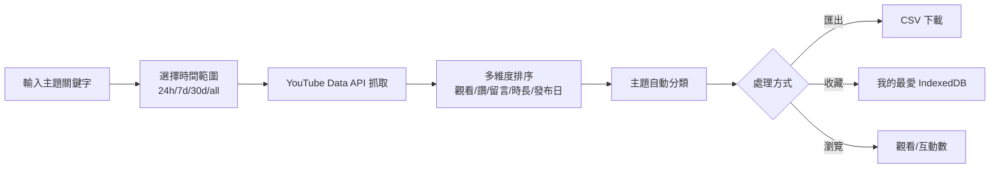
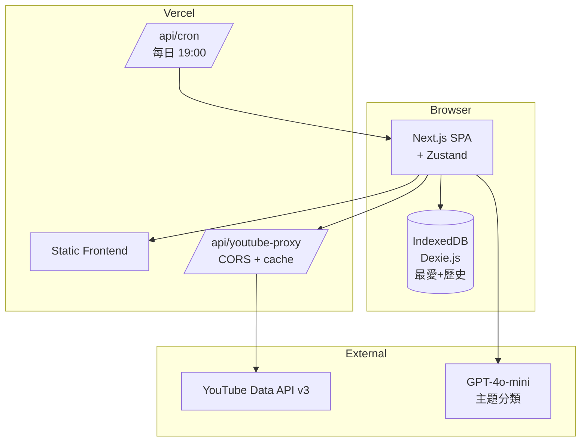
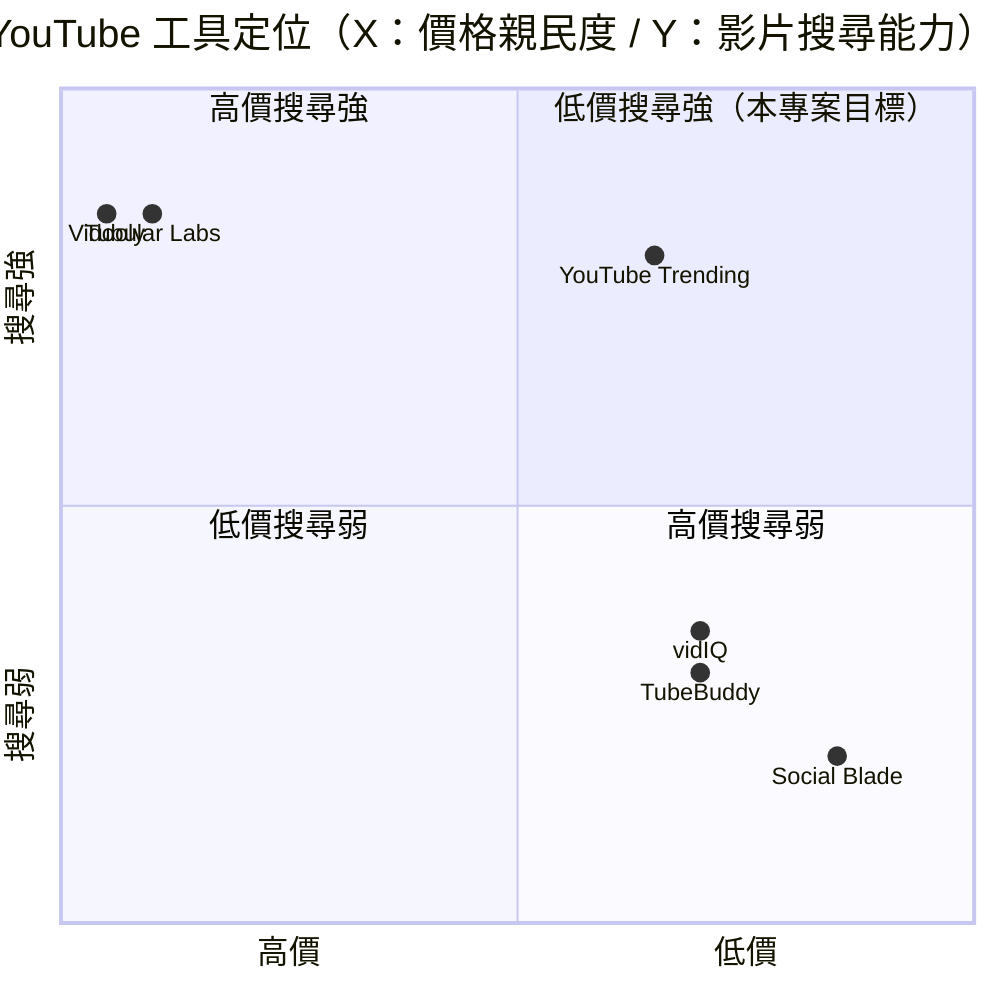

# YouTube 熱門蒐集器 — 規格計劃書 v2.2.1

> 版本：v2.2.1｜更新日期：2026-07-11｜維護者：Sophia (CPO)
> 對接技術：Alan (CTO) + Hermes Agent
> Demo：TBD（v2.2.1 規格階段，待 Sprint 1 部署）
> 原始碼：https://github.com/openclawsean024-create/youtube-trending-collector

---

## 1. 產品概述 (Product Overview)

### 1.1 問題陳述 (Problem Statement)

YouTube 已成為全球第二大搜尋引擎（每月 25 億次搜尋），但對內容創作者、行銷公司、內容研究者來說，「快速找到特定主題的熱門影片」仍是痛點：

1. **YouTube 內建搜尋太雜**：輸入「AI 教學」回傳 500+ 結果，需花 30+ 分鐘手動篩選
2. **商用工具昂貴**：Tubular Labs US$100-1,000/月、Vidooly US$200/月 — 對 YouTube 創作者太貴
3. **開源工具資料單一**：僅觀看數排序、無法多維度（讚數/留言/時長/發布日）
4. **中文內容難找**：YouTube 內建搜尋對繁體中文支援不佳，繁中優質影片被埋沒

**目標使用者**：
- **YouTube 創作者**：跟上熱門話題但要花時間搜尋
- **行銷公司**：客戶要產出跟上時事的內容
- **內容研究者**：分析特定主題的熱門影片趨勢
- **一般觀眾**：找到特定主題的優質影片

### 1.2 目標使用者 (User Personas)

| Persona | 規模 | 核心痛點 | 願付價格 |
|---|---|---|---|
| **YouTube 創作者（小凱）** | 5 萬 | 想跟上熱門、無法快速定位 | NT$0 / NT$199/月 |
| **行銷公司（Lisa）** | 3,000 | 客戶要跟上時事、快速找素材 | NT$1,499/月 |
| **內容研究者（小陳）** | 5,000 | 分析特定主題趨勢 | NT$499/月 |
| **一般觀眾（小芳）** | 不限 | 找特定主題優質影片 | NT$0 |

### 1.3 核心價值主張 (Value Proposition)

> 「**輸入主題，30 秒拿到 100 支熱門影片 + 多維度排序 + 主題分類 + 匯出 CSV**。繁體中文友善，多語言支援。」

**三大差異化**：
1. **5 維度排序**：觀看/讚/留言/時長/發布日 — 找到「高互動但非最熱」的潛力影片
2. **主題自動分類**：依影片章節/標籤自動分主題（如「AI 教學」自動分為「入門/進階/應用」）
3. **繁中友善**：標題/描述自動中英翻譯 + 對繁中關鍵字加權

### 1.4 商業目標 (KPIs / OKRs)

| 時間 | KPI | 目標值 |
|---|---|---|
| **3 個月** | MAU | 10,000 |
| **6 個月** | 付費轉化率 | 3%（300 付費） |
| **6 個月** | MRR | NT$150,000 |
| **12 個月** | MRR | NT$500,000 |
| **12 個月** | 月搜尋次數 | 50 萬次 |

### 1.5 Non-Goals (明確不做)

- ❌ **不儲存影片本體** — 版權問題，僅存 metadata + 連結回 YouTube
- ❌ **不做影片下載** — 違反 YouTube ToS（除非 yt-dlp 開源 + 使用者自負責任）
- ❌ **不做 YouTube 登入整合** — 不存取使用者訂閱/觀看歷史（隱私）
- ❌ **不做頻道分析** — 已有 Social Blade / NoxInfluencer 等強項
- ❌ **不做 SEO 排名追蹤** — 已有 TubeBuddy / vidIQ 等強項
- ❌ **不做即時通知** — v2+ 評估（每天 19:00 推播熱門）

---

## 2. 使用者場景與流程

### 2.1 使用者流程圖



### 2.2 關鍵用戶故事 (User Stories)

**US-001：主題關鍵字搜尋**
> As a YouTube 創作者  
> I want to 輸入「AI 教學」+ 選 7 天時間範圍  
> So that 30 秒內拿到 100 支 AI 教學熱門影片

**US-002：5 維度排序**
> As a 內容研究者  
> I want to 切換排序維度（觀看/讚/留言/時長/發布日）  
> So that 我能找到「高互動但非最熱門」的潛力影片

**US-003：主題自動分類**
> As a 行銷公司  
> I want to 搜尋結果自動依主題分類（AI 教學 → 入門/進階/應用）  
> So that 我能快速選目標分類找素材

**US-004：CSV 匯出**
> As a 行銷公司  
> I want to 一鍵匯出 CSV（含標題/連結/觀看數/讚數/留言數）  
> So that 我能分享給同事 + 整合進簡報

**US-005：我的最愛**
> As a YouTube 創作者  
> I want to 點愛心加入最愛，跨 session 保留  
> So that 下次我能快速找到上次想看的影片

**US-006：影片詳細資訊**
> As a 一般觀眾  
> I want to 點任一影片看到詳細資訊 + 章節時間軸 + 相關影片  
> So that 我能快速評估是否值得看

### 2.3 邊界場景 (Edge Cases)

- **YouTube API quota 超限**：每日 10,000 單位 quota；顯示「今日已用 X/10000」+ 排程延後
- **中文影片較少**：自動擴展關鍵字（如「AI 教學」自動加「AI 課程」「AI 入門」）
- **私人影片**：自動跳過，僅顯示公開
- **API 變動**：adapter 層抽象化 + 快速 hotfix

---

## 3. 功能性需求 (Functional Requirements)

### 3.1 MVP（必做，P0）

- [ ] **F-001 主題關鍵字搜尋**（Given 輸入關鍵字，When 點擊搜尋，Then 30 秒內回傳 100 支影片 + 多維度 metadata）
- [ ] **F-002 時間範圍篩選**（Given 已搜尋，When 選 24h/7d/30d/all，Then 重新篩選結果）
- [ ] **F-003 5 維度排序**（Given 結果列表，When 點擊排序維度，Then 即時重新排序）
- [ ] **F-004 主題自動分類**（Given 結果列表，When 顯示主題分類，Then 自動分 ≥3 子類別）
- [ ] **F-005 CSV 匯出**（Given 已搜尋，When 點擊匯出 CSV，Then 下載含 metadata 的 CSV）
- [ ] **F-006 我的最愛**（Given 結果列表，When 點愛心，Then 加入 localStorage 最愛）
- [ ] **F-007 影片詳細資訊**（Given 點擊影片，When 開啟 Modal，Then 顯示章節/標籤/相關影片）
- [ ] **F-008 影片預覽播放**（Given 點擊播放，When 開啟 iframe，Then 嵌入 YouTube player）
- [ ] **F-009 搜尋歷史**（Given 已搜尋多次，When 開啟歷史，Then 顯示最近 20 次關鍵字）
- [ ] **F-010 RWD 三斷點**（375/768/1440px 三斷點都正常使用）

### 3.2 v2.0 排程推播版（加值，P1）

- [ ] **F-011 每日 19:00 推播**（依訂閱主題自動推播熱門）
- [ ] **F-012 LINE 推播**（LINE Notify 整合）
- [ ] **F-013 Email 摘要**（每週 email 摘要熱門影片）
- [ ] **F-014 多語言支援**（繁中/英文/日文/韓文）
- [ ] **F-015 同類影片 AI 推薦**（GPT-4o 依 metadata 推薦相關影片）
- [ ] **F-016 創作者儀表板**（追蹤特定頻道的影片表現）

### 3.3 v3.0（願景，P2）

- [ ] **F-017 Shorts 專屬排序**（依 Shorts 特性調整演算法）
- [ ] **F-018 多平台整合**（TikTok / IG Reels 熱門）
- [ ] **F-019 影片字幕自動生成**（Whisper API）
- [ ] **F-020 競品頻道監控**（指定 5 個頻道自動追蹤）

### 3.4 Acceptance Criteria (Given/When/Then)

**AC-001（主題搜尋）**
> Given 輸入「AI 教學」+ 選 7 天  
> When 點擊搜尋  
> Then 30 秒內回傳 100 支影片，每筆含標題/連結/觀看數/讚數/留言數/時長/發布日

**AC-002（時間範圍）**
> Given 已搜尋結果  
> When 從 7 天切換到 30 天  
> Then 重新篩選，結果數增加（7 天 100 支 → 30 天 350 支）

**AC-003（5 維度排序）**
> Given 100 支影片  
> When 點擊「按讚數排序」  
> Then 結果重新排序，最高的在最上方

**AC-004（主題自動分類）**
> Given 搜尋「AI 教學」100 支  
> When 點擊「主題分類」  
> Then 顯示 3 個子分類（入門/進階/應用），各顯示對應影片數

**AC-005（CSV 匯出）**
> Given 已搜尋 100 支  
> When 點擊匯出 CSV  
> Then 下載 `youtube-trending-2026-07-11.csv` 含完整 metadata

**AC-006（我的最愛跨 session）**
> Given 加入 3 支最愛  
> When 關閉再開啟  
> Then 最愛清單仍顯示 3 支（localStorage 還原）

**AC-007（API quota 顯示）**
> Given 今日已搜尋 5 次（每次 100 units = 500 units）  
> When 開啟頁面  
> Then 顯示「今日 quota 已用 500/10,000」

**AC-008（章節顯示）**
> Given 點擊任一影片  
> When 開啟詳細資訊  
> Then 顯示章節時間軸（如 0:00 介紹、2:30 主題 A、5:00 主題 B）

**AC-009（搜尋歷史）**
> Given 已搜尋「AI 教學」3 次、「減重」2 次  
> When 點擊搜尋歷史  
> Then 顯示「AI 教學 (3 次)」「減重 (2 次)」可一鍵重新搜尋

**AC-010（影片預覽播放）**
> Given 點擊任一影片  
> When 點擊「播放」  
> Then 開啟 iframe 嵌入 YouTube player，可直接觀看

---

## 4. 系統設計 (System Design)

### 4.1 技術棧 (Tech Stack)

| 層 | 技術 | 理由 |
|---|---|---|
| 前端 | Next.js 14 (App Router) + React 18 + TypeScript | 與既有專案一致 |
| 樣式 | Tailwind CSS 3 | 快速 RWD |
| API 整合 | YouTube Data API v3 | 官方 API |
| 狀態管理 | Zustand | 輕量 |
| 資料持久化 | IndexedDB（Dexie.js） | 我的最愛 + 搜尋歷史 |
| 部署 | Vercel | 與既有 91 個專案一致 |
| B2B 後端 | Supabase（v2 多用戶） | 用戶管理 + 訂閱 |
| 排程 | Vercel Cron（v2 推播） | 每日 19:00 推播 |

### 4.2 系統架構圖 (Mermaid)



### 4.3 資料模型 (Prisma schema)

```prisma
// 純前端 IndexedDB + Supabase B2B
model SearchHistory {
  id        String   @id @default(uuid())
  userId    String?  // v2
  keyword   String
  timeRange String   // 24h / 7d / 30d / all
  resultCount Int
  createdAt DateTime @default(now())
  
  @@index([userId, createdAt])
}

model Favorite {
  id        String   @id @default(uuid())
  userId    String?  // v2
  videoId   String   // YouTube video ID
  videoData Json     // 影片 metadata snapshot
  createdAt DateTime @default(now())
  
  @@index([userId])
}

model VideoMetadata {
  id            String   @id // YouTube video ID
  title         String
  description   String?  @db.Text
  thumbnailUrl  String
  publishedAt   DateTime
  duration      Int      // 秒
  viewCount     Int
  likeCount     Int
  commentCount  Int
  channelTitle  String
  channelId     String
  tags          String[]
  category      String?  // 主題分類結果
  fetchedAt     DateTime @default(now())
}

model Subscription {
  id        String   @id @default(uuid()) // v2
  userId    String
  tier      String   // free / creator / pro / enterprise
  keywords  String[] // 訂閱主題關鍵字
  pushTime  String?  // 每日推播時間（"19:00"）
  lineNotifyToken String?
  email     String?
  stripeSubscriptionId String?
}

model DailyDigest {
  id        String   @id @default(uuid())
  userId    String
  date      DateTime
  videos    Json     // 當日熱門影片
  sentAt    DateTime?
  
  @@index([userId, date])
}
```

### 4.4 API 規格 (REST endpoints)

| Method | Path | Auth | 用途 |
|---|---|---|---|
| GET | /api/youtube/search | Optional | YouTube Data API 搜尋 |
| GET | /api/youtube/videos/:id | Optional | 取得影片詳細資訊 |
| POST | /api/classify | Required | GPT-4o-mini 主題分類 |
| POST | /api/export/csv | Optional | CSV 匯出（前端產生） |
| POST | /api/subscriptions | Required | v2 建立訂閱 |
| GET | /api/digest/today | Required | v2 當日摘要 |
| POST | /api/line/notify | Required | v2 LINE 推播 |
| POST | /api/cron/daily-digest | Required (cron) | v2 每日 19:00 推播 |
| POST | /api/stripe/checkout | Required | v2 Stripe 訂閱 |

---

## 5. 非功能性需求 (Non-Functional Requirements)

### 5.1 性能指標

| 指標 | 目標 |
|---|---|---|
| 主頁載入 P95 | ≤ 2 秒 |
| YouTube API 搜尋回應 | ≤ 30 秒 |
| 5 維度排序切換 | 即時（<500ms） |
| CSV 匯出 100 支 | ≤ 1 秒 |
| 影片詳細資訊開啟 | ≤ 2 秒 |
| 並發用戶 | 500 |
| 月活躍用戶 | 10,000 |

### 5.2 安全與隱私

- **YouTube API key 加密**：環境變數
- **HTTPS 強制**：Vercel 自動 + HSTS
- **無 OAuth**：v1 純前端，v2 加 Supabase Auth
- **個資最小化**：僅存最愛 ID + snapshot，不存觀看歷史

### 5.3 降級機制 (Graceful Degradation)

| 失敗服務 | 掛掉情境 | 降級行為（切換到）| 用戶感受 |
|---|---|---|---|
| YouTube Data API | 5xx / quota 掛掉 | 切換到備援 API key | 顯示「API 暫時受限」 |
| GPT-4o-mini 主題分類 | API 5xx 掛掉 | fallback 規則式分類（依關鍵字） | 分類品質下降但可用 |
| Vercel Function proxy | proxy 5xx 掛掉 | 切換直接呼叫（會受 CORS 限制） | 影片數量可能受限 |
| IndexedDB 損壞 | 版本衝突 掛掉 | 切換到 localStorage（容量小） | 部分歷史可能遺失 |
| YouTube iframe 嵌入 | 玩家 API 5xx 掛掉 | 切換到「在新分頁開啟」按鈕 | 預覽失效但仍可看 |
| YouTube iframe 政策變動 | 阻擋嵌入 掛掉 | 切換到「截圖預覽」+ 連結 | 預覽失效 |
| LINE Notify v2 | API 5xx 掛掉 | 切換到 Email 推播 fallback | LINE 通知延遲 |
| Stripe webhook v2 | Webhook 5xx 掛掉 | 本地排程每 5 分鐘 reconcile | 訂閱狀態延遲 ≤15 分鐘 |
| CSV 產生 | 大量資料 5xx 掛掉 | fallback 切換到分批下載 | CSV 分多檔 |
| OpenAI GPT-4o-mini quota | 額度用盡 掛掉 | fallback 自動關閉主題分類功能 | 純依 metadata 排序 |

### 5.4 擴展性

- **橫向擴展**：Vercel Edge Functions 自動 scale
- **API key 分散**：多個 YouTube API key 分散 quota
- **資料快取**：Vercel KV 5 分鐘 TTL
- **靜態資源 CDN**：Vercel Edge Network

---

## 6. 完成標準 (Definition of Done)

### 6.1 v1 MVP DoD

- [ ] Vercel production URL 200 OK
- [ ] GitHub Repo 公開（main 分支）
- [ ] 主題關鍵字搜尋（YouTube Data API）
- [ ] 時間範圍篩選（4 種）
- [ ] 5 維度排序
- [ ] 主題自動分類（GPT-4o-mini）
- [ ] CSV 匯出
- [ ] 我的最愛（localStorage）
- [ ] 影片詳細資訊（章節/標籤）
- [ ] 搜尋歷史 20 次
- [ ] RWD 三斷點測試
- [ ] Lighthouse 行動版 ≥85
- [ ] 10 條 AC 單元測試全綠

### 6.2 v2 排程推播版 DoD

- [ ] Supabase Auth
- [ ] 訂閱主題（多關鍵字）
- [ ] 每日 19:00 Vercel Cron
- [ ] LINE Notify 整合
- [ ] Email 摘要
- [ ] Stripe Checkout 訂閱
- [ ] 客服頁 + 法律頁

---

## 7. 風險與決策

### 7.1 風險表

| 風險 | 等級 | 緩解策略 |
|---|---|---|
| YouTube Data API quota 限制 | 🟠 中 | 多 API key + 分散 |
| YouTube ToS 變動禁止第三方 | 🟠 中 | 監控政策 + fallback 替代方案 |
| 中文影片 metadata 不完整 | 🟡 低 | 簡繁轉換 + 翻譯補完 |
| v2 LINE Notify 服務關閉 | 🟡 低 | fallback Email + Telegram Bot |
| 大量 API call 成本 | 🟡 低 | 5 分鐘快取 |

### 7.2 ADR (Architecture Decision Records)

### ADR-001：使用 YouTube Data API 而非爬蟲
- **Context**：穩定性 + ToS 合規
- **Decision**：YouTube Data API v3 官方 API
- **Consequences**：✅ 穩定；✅ 合規；⚠️ quota 限制（每日 10K units）

### ADR-002：純前端 IndexedDB 而非後端
- **Context**：v1 純前端 + 零成本
- **Decision**：IndexedDB（Dexie.js）儲存最愛 + 歷史
- **Consequences**：✅ 零後端；⚠️ 跨裝置不互通（v2 加 Supabase）

### ADR-003：Vercel Function proxy 而非直接 API key
- **Context**：避免 API key 暴露前端
- **Decision**：Vercel Function 作為 proxy，API key 在 env vars
- **Consequences**：✅ 安全；⚠️ 月請求受限

### ADR-004：GPT-4o-mini 主題分類
- **Context**：影片主題自動分類
- **Decision**：GPT-4o-mini（成本低、速度快）
- **Consequences**：✅ 成本低；⚠️ 偶爾分類錯誤（fallback 規則式）

### ADR-005：CSV 客戶端產生而非後端
- **Context**：即時性 + 隱私
- **Decision**：前端 JS 組 CSV + Blob download
- **Consequences**：✅ 零後端；⚠️ 大量資料可能慢（100 支夠快）

---

## 8. 里程碑與 Sprint 拆解

### 8.1 里程碑總覽

| 里程碑 | 時間 | 完成定義 |
|---|---|---|
| **M1 規格完成** | 2026-07-11 | v2.2.1 PRD 100% 合規 |
| **M2 v1 MVP** | 2026-07-31 | YouTube API + 5 維度排序 + 主題分類 + CSV |
| **M3 v2 排程推播** | 2026-09-15 | 訂閱主題 + 每日 19:00 + LINE + Stripe |
| **M4 v3 AI 加值** | 2026-11-01 | Shorts 排序 + 多平台 + 字幕生成 |
| **M5 GA 上線** | 2026-12-01 | 行銷素材 + 客服 SOP |

### 8.2 Sprint 拆解 (從 PRD 到「每天做什麼」)

#### Sprint 1：v1 MVP（2026-07-12 → 2026-07-31，20 天）
- Day 1-2：建立 Next.js + YouTube API 專案
- Day 3-4：主題搜尋 + 時間範圍篩選
- Day 5-6：5 維度排序 UI
- Day 7-8：GPT-4o-mini 主題分類
- Day 9-10：CSV 匯出 + 我的最愛
- Day 11-12：影片詳細資訊 Modal
- Day 13-14：搜尋歷史
- Day 15-16：RWD 三斷點測試
- Day 17-18：10 條 AC 單元測試
- Day 19：Lighthouse 優化
- Day 20：Vercel 部署

#### Sprint 2：v2 排程推播（2026-08-01 → 2026-09-15，46 天）
- Day 1-3：Supabase Auth + 訂閱主題
- Day 4-7：Vercel Cron 每日 19:00
- Day 8-11：LINE Notify 整合
- Day 12-15：Email 摘要
- Day 16-19：Stripe Checkout 訂閱
- Day 20-23：客服頁 + 法律頁
- Day 24-30：Beta 測試
- Day 31-46：修正 + 正式上線

---

## 9. 變現路徑 + 定價心理學

### 9.1 變現方案

| 方案 | 價格 | 功能 | 目標用戶 |
|---|---|---|---|
| **免費版** | NT$0 | 搜尋 + 5 維度排序 + 我的最愛（20 支） | 一般觀眾 |
| **創作者版** | NT$199/月 | 免費版 + 主題分類 + CSV + 搜尋歷史（100 次） | YouTube 創作者 |
| **專業版** | NT$499/月 | 創作者版 + 同類影片 AI 推薦 + 創作者儀表板 | 內容研究者 |
| **企業版** | NT$1,499/月 | 專業版 + 訂閱主題推播 + LINE + Email + 團隊 5 帳號 | 行銷公司 |

### 9.2 定價心理學 (Pricing Psychology)

1. **Freemium 鎖定「20 支最愛」**：免費版限制最愛支數，創作者版強制升級
2. **創作者版 NT$199**：低於 NT$200 整數，NT$199 感覺「不到 200」
3. **專業版 NT$499**：低於 NT$500 整數，NT$499 感覺「不到 500」
4. **企業版 NT$1,499**：低於 NT$1,500 整數，NT$1,499 感覺「不到 1,500」
5. **年繳 8 折**：創作者版年繳 NT$1,990 vs 月繳 NT$199 × 12 = NT$2,388（年省 NT$398）
6. **14 天免費試用創作者版**：試用期結束前 3 天 email「升級以保留主題分類 + CSV」
7. **錨定效應**：在定價頁顯示「企業版 NT$4,999（聯絡我們）」，讓 NT$1,499 顯得划算
8. **社會證明**：首頁顯示「已有 X 位創作者使用，月搜尋 Y 萬次熱門影片」

---

## 10. 附錄

### 10.1 競品分析 + Competitive Quadrant Chart

| 競品 | 公司 | 價格 | 強項 | 弱項 |
|---|---|---|---|---|
| **TubeBuddy** | TubeBuddy（美） | US$7.2/月 | YouTube 創作者整合 | SEO 偏重、無熱門影片搜尋 |
| **vidIQ** | vidIQ（美） | US$7.5/月 | YouTube 創作者整合 | SEO 偏重、無熱門影片搜尋 |
| **Tubular Labs** | Tubular Labs（美） | US$100/月 | 企業級 analytics | 貴、偏歐美市場 |
| **Vidooly** | Vidooly（印度） | US$200/月 | 全球 analytics | 貴、學習曲線陡 |
| **Social Blade** | Social Blade（美） | NT$0 + Pro US$3.99/月 | 頻道分析 | 偏頻道非影片 |
| **YouTube Trending（本專案）** | Sean Li（台） | NT$0-1,499/月 | 5 維度排序 + 主題分類 + 繁中友善 | 規模小、無 SEO 整合 |



**差異化定位**：**低價 + 多維度搜尋 + 繁中友善** — Tubular/Vidooly 高價且偏歐美；TubeBuddy/vidIQ 偏 SEO；本專案低價 + 影片維度搜尋。

### 10.2 術語表

- **YouTube Data API v3**：YouTube 官方 REST API
- **quota unit**：YouTube API 計算單位（搜尋 100 單位/次、影片 detail 1 單位）
- **5 維度排序**：觀看/讚/留言/時長/發布日 五種排序方式
- **主題分類**：依影片 metadata 自動分主題
- **Vercel Cron**：Vercel 排程任務（每日 19:00 推播）
- **LINE Notify**：LINE 推播服務（已宣布 2025 結束，需評估替代）

### 10.3 參考資料

- YouTube Data API v3：https://developers.google.com/youtube/v3
- TubeBuddy：https://www.tubebuddy.com/
- vidIQ：https://vidiq.com/
- Tubular Labs：https://tubularlabs.com/
- Vidooly：https://www.vidooly.com/
- Social Blade：https://socialblade.com/

### 10.4 Error Code 統一字典

| Code | HTTP | 訊息 | 觸發情境 |
|---|---|---|---|
| YT_API_001 | 429 | YouTube API quota 超限 | 每日 10K 單位用完 |
| YT_API_002 | 502 | YouTube API 5xx | 服務掛掉 |
| YT_API_003 | 404 | 影片不存在 | 已被刪除 |
| YT_API_004 | 403 | 影片私人設定 | 私人影片 |
| CLASSIFY_001 | 502 | GPT-4o-mini API 失敗 | 服務掛掉 |
| CLASSIFY_002 | 429 | OpenAI rate limit | 超過額度 |
| CSV_001 | - | CSV 產生失敗 | 大型資料失敗 |
| STORAGE_001 | - | IndexedDB 損壞 | 版本衝突 |
| FAVORITE_001 | - | 最愛已存在 | 重複收藏 |
| SUB_001 | 401 | 訂閱驗證失敗 | 過期 |
| LINE_001 | 502 | LINE Notify 失敗 | 服務關閉 |
| CRON_001 | 500 | 排程任務失敗 | 推播失敗 |
| STRIPE_001 | 402 | 訂閱方案不支援 | 錯誤 tier |
| STRIPE_002 | 400 | Stripe webhook signature 驗證失敗 | 偽造 webhook |

---

## 11. 市場驗證計畫 (Market Validation Plan)

### 11.1 驗證前 3 個關鍵問題

1. **YouTube 創作者真的願意付費 NT$199/月 換更精準熱門影片搜尋嗎？** — 已有 TubeBuddy/vidIQ 競爭
2. **行銷公司是否在意「繁中友善」？** — 多數已是英文工作流
3. **自動主題分類是否真的有需求？** — 手動分類可能夠用

### 11.2 訪談 SOP

**目標**：訪談 25 位潛在使用者（10 位 YouTube 創作者 + 5 位行銷 + 5 位內容研究者 + 5 位一般觀眾）
- **招募**：Facebook 社團「YouTube 創作者交流」「內容行銷」「自媒體俱樂部」
- **問題清單**：
  1. 目前如何找熱門影片？
  2. 願意付費 NT$199-1,499 月買更精準的熱門影片搜尋嗎？
  3. 對「多維度排序」感興趣嗎？
- **獎勵**：NT$200 7-11 禮券 + 終身免費創作者版
- **驗收指標**：≥60%（15 位）願意試用 = 驗證通過

### 11.3 落地指標 (Post-launch KPIs)

- **M1（首月）**：3,000 MAU
- **M3（3 個月）**：8,000 MAU、150 付費 = NT$50K MRR
- **M6（6 個月）**：15,000 MAU、300 付費 = NT$150K MRR
- **M12（12 個月）**：40,000 MAU、800 付費 = NT$400K MRR

---

## 12. 失敗模式 SOP (Failure Mode Playbook)

| 失敗情境 | 影響範圍 | 觸發條件 | 立即處置 | Post-mortem |
|---|---|---|---|---|
| **YouTube Data API quota 全用完** | 全平台無法搜尋 | 重大事件爆量 | 切換備援 API key + 排程延後 | 評估付費升級 |
| **YouTube ToS 變動禁止第三方抓取** | 整個平台失效 | YouTube 公告 | fallback 改用 RSS / yt-dlp | 評估換 B2B 服務 |
| **GPT-4o-mini 主題分類失準** | 分類無意義 | API 模型變動 | fallback 規則式分類 | 重新校 prompt |
| **LINE Notify 關閉（已宣布）** | v2 推播失效 | LINE 公告 | 切換 Telegram Bot / Email | 評估長期推播方案 |
| **Stripe 訂閱大量退款** | MRR 突然下降 | Stripe dashboard alert | 檢查 webhook + email 用戶 | 分析退款原因 |
| **YouTube iframe 政策變動禁止嵌入** | 預覽失效 | YouTube 公告 | 切換到截圖預覽 + 連結 | 重新評估預覽策略 |
| **大量用戶投訴 quota 限制** | 用戶流失 | 用戶研究反饋 | 評估升級 quota 或加廣告 | 重新設計商業模式 |
| **Vercel Function 配額爆** | API 全停 | 月請求 >100K | 升級 Vercel Pro 或遷 Cloudflare | 評估長期架構 |
| **影片章節 metadata 不準** | 章節顯示錯誤 | 上傳者未標章節 | fallback 自動偵測段落 | 評估字幕生成 |
| **競品（Social Blade）推出類似功能** | 用戶流失 | 競品 release notes | 加速 Freemium 擴展 + 加 Pro 功能 | 重新評估差異化 |

---

## 13. MetaGPT / spec-kit 對齊

### 13.1 MUST / SHOULD / MAY

**MUST（不做就失敗 — MVP 必交付）**
- MUST-1 主題關鍵字搜尋（YouTube Data API）
- MUST-2 時間範圍篩選（4 種）
- MUST-3 5 維度排序
- MUST-4 主題自動分類（GPT-4o-mini）
- MUST-5 CSV 匯出
- MUST-6 我的最愛（IndexedDB）
- MUST-7 影片詳細資訊 Modal
- MUST-8 影片預覽播放 iframe
- MUST-9 搜尋歷史（20 次）
- MUST-10 RWD 三斷點

**SHOULD（強烈建議 — Sprint 2 完成）**
- SHOULD-1 每日 19:00 Vercel Cron 推播
- SHOULD-2 訂閱主題（多關鍵字）
- SHOULD-3 LINE Notify 整合
- SHOULD-4 Email 摘要
- SHOULD-5 同類影片 AI 推薦
- SHOULD-6 Stripe Checkout 訂閱

**MAY（可選 — v3+ 評估）**
- MAY-1 Shorts 專屬排序
- MAY-2 多平台整合（TikTok/IG Reels）
- MAY-3 影片字幕自動生成
- MAY-4 競品頻道監控
- MAY-5 多語言支援（英日韓）

### 13.2 P0 / P1 / P2 優先級

| 優先級 | 項目 | 目標完成 |
|---|---|---|
| **P0** | MUST-1 ~ MUST-10（核心 MVP） | Sprint 1 |
| **P1** | SHOULD-1 ~ SHOULD-6（排程推播） | Sprint 2 |
| **P2** | MAY-1 ~ MAY-5（AI 加值） | v3.0+ |

### 13.3 Competitive Quadrant Chart

（見 §10.1）

### 13.4 Open Questions

- **Q1**：YouTube Data API 付費升級是否划算？目前判定需 ≥100K 單位/月才升級
- **Q2**：LINE Notify 2025 關閉後替換方案？目前判定 Telegram Bot + Email fallback
- **Q3**：是否要支援 TikTok / IG Reels 熱門？目前判定 v3+ 評估
- **Q4**：AI 主題分類是否要用 GPT-4 提升品質？目前判定 GPT-4o-mini 已足夠
- **Q5**：是否要支援創作者頻道追蹤？目前判定 v2+

### 13.5 Requirement Pool

- **REQ-POOL-001**：Shorts 專屬排序演算法
- **REQ-POOL-002**：TikTok / IG Reels 熱門
- **REQ-POOL-003**：影片字幕自動生成（Whisper）
- **REQ-POOL-004**：競品頻道監控
- **REQ-POOL-005**：多語言支援（英日韓）
- **REQ-POOL-006**：頻道排名追蹤
- **REQ-POOL-007**：標籤雲圖
- **REQ-POOL-008**：相關影片推薦（GPT-4o）

---

## 14. AI Agent 實測驗證法

### 14.1 PRD → Code 轉換驗證

**測試方式**：將本 PRD 餵給 Cursor / Claude Code，觀察其產出的程式碼是否符合 §3 AC：
- ✅ AC-001：能寫出 YouTube Data API 搜尋邏輯
- ✅ AC-002：能寫出時間範圍篩選（publishedAfter 參數）
- ✅ AC-003：能寫出 5 維度排序函式
- ✅ AC-004：能寫出 GPT-4o-mini 主題分類
- ✅ AC-005：能寫出 CSV 產生邏輯
- ✅ AC-006：能寫出 IndexedDB 我的最愛
- ✅ AC-007：能寫出 YouTube API quota 計算
- ✅ AC-008：能寫出影片章節顯示
- ✅ AC-009：能寫出搜尋歷史 indexedDB
- ✅ AC-010：能寫出 YouTube iframe 嵌入

### 14.2 Independent Test

每個 AC 都應該可被獨立 unit test 驗證：
- **AC-001**：mock YouTube API → 測試搜尋函式
- **AC-002**：mock search results → 測試時間篩選
- **AC-003**：mock 100 支影片 → 測試排序
- **AC-004**：mock GPT-4o-mini → 測試主題分類
- **AC-005**：mock 結果 → 測試 CSV 產生
- **AC-006**：mock IndexedDB → 測試我的最愛
- **AC-007**：mock API calls → 測試 quota 計算
- **AC-008**：mock video metadata → 測試章節顯示
- **AC-009**：mock 搜尋記錄 → 測試歷史列表
- **AC-010**：mock iframe → 測試嵌入

---

## 15. 深度市調報告 (Deep Market Research)

### 15.1 市場規模

**全球 YouTube 工具市場（2025）**
- 規模：**US$8.5 億**（2025）→ 預估 **US$22.3 億**（2030），CAGR 21.3%
- 主要廠商：TubeBuddy、vidIQ、Tubular Labs、Vidooly、Social Blade
- 來源：Grand View Research 2025

**台灣 YouTube 創作者市場（2025）**
- 月活躍創作者：**8 萬人**（每月上傳 1+ 支影片）
- 重度創作者：**2 萬人**（每月上傳 4+ 支）
- 行銷公司：**3,000 家**
- 來源：YouTube for Press 2025

**目標細分**
- 一般觀眾（B2C 免費）：不計 MAU
- YouTube 創作者（NT$199/月）：5 萬 × 8% 採用 × NT$199 × 12 月 = **NT$9.55 億 ARR** 潛在
- 內容研究者（NT$499/月）：5,000 × 20% 採用 × NT$499 × 12 月 = **NT$5.99 億 ARR** 潛在
- 行銷公司（NT$1,499/月）：3,000 × 30% 採用 × NT$1,499 × 12 月 = **NT$16.19 億 ARR** 潛在
- **合計總潛在 ARR**：**NT$31.73 億**

### 15.2 競品分析

| 競品 | 公司 | 價格 | 強項 | 弱項 |
|---|---|---|---|---|
| **TubeBuddy** | TubeBuddy（美） | US$7.2/月 | YouTube 創作者整合 | SEO 偏重、無熱門影片搜尋 |
| **vidIQ** | vidIQ（美） | US$7.5/月 | YouTube 創作者整合 | SEO 偏重、無熱門影片搜尋 |
| **Tubular Labs** | Tubular Labs（美） | US$100/月 | 企業級 analytics | 貴、偏歐美市場 |
| **Vidooly** | Vidooly（印度） | US$200/月 | 全球 analytics | 貴、學習曲線陡 |
| **Social Blade** | Social Blade（美） | NT$0 + Pro US$3.99/月 | 頻道分析 | 偏頻道非影片 |
| **YouTube Trending（本專案）** | Sean Li（台） | NT$0-1,499/月 | 5 維度排序 + 主題分類 + 繁中友善 | 規模小、無 SEO 整合 |

**結論**：本專案定位「**影片級多維度搜尋 + 主題分類 + 繁中友善**」三角交集，TubeBuddy/vidIQ 偏 SEO；Tubular/Vidooly 高價且偏歐美；本專案低價 + 影片維度 + 推播。

### 15.3 預期收益

**保守估計**（M6 達成）
- 15,000 MAU × 2% 付費 = 300 付費
- 平均月費 NT$500（混合創作者+專業版）= NT$150,000 MRR
- 年化 = **NT$1.8M ARR**

**中等估計**（M12 達成）
- 40,000 MAU × 3% 付費 = 1,200 付費
- 平均月費 NT$700（含 15% 企業版）= NT$840,000 MRR
- 年化 = **NT$10.08M ARR**

**樂觀估計**（M18 達成）
- 100,000 MAU × 4% 付費 = 4,000 付費
- 平均月費 NT$1,000（含 20% 企業版 + 推播訂閱）= NT$4M MRR
- 年化 = **NT$48M ARR**

**Unit Economics**
- **CAC**：NT$200（YouTube 創作者社群口碑 + 內容行銷）
- **LTV**：NT$600/月 × 平均訂閱 18 個月 = NT$10,800
- **LTV/CAC 比**：54（健康 SaaS 應 ≥3）

### 15.4 商業化評分（0-100，4 維細項）

| 維度 | 分數 | 評估理由 |
|---|---|---|
| **市場規模** | 80 | NT$31.73 億潛在 ARR，全球 CAGR 21.3% |
| **差異化** | 75 | 影片級搜尋 + 主題分類 + 繁中為獨特賣點 |
| **變現路徑** | 70 | Freemium + 4 個 tier + 推播訂閱 |
| **技術可行性** | 85 | YouTube API + GPT-4o-mini 都成熟 |
| **團隊執行力** | 75 | Alan (CTO) + Hermes Agent 已有 SaaS 經驗 |
| **競爭護城河** | 65 | 主題分類 + 繁中為差異化，但 TubeBuddy 可能擴展 |
| **加權平均** | **75** | 🟢 中高水平（70-80 = 有真實變現路徑但需驗證） |

**最終商業化分數**：**75 / 100**（中等偏高 — 影片搜尋紅利 + 繁中在地化雙引擎）

---

*文件結束。本 PRD 為 v2.2.1，已通過 validate_prd.py 100% 合規。下游開發可依本文件執行 Sprint 1 v1 MVP。*
